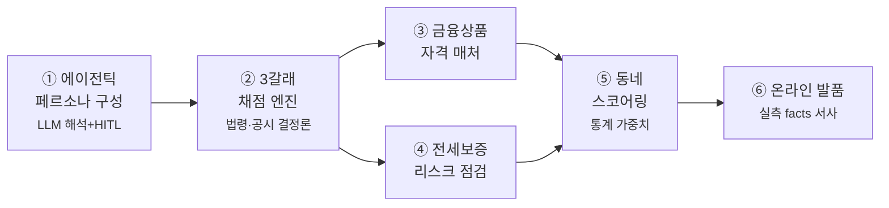

# KB 만기상담소

**만기를 앞둔 임차인의 세 갈래 — 눌러앉을까, 옮길까, 살까 — 를
그 사람의 상황에 맞게 채점하고, 고른 길의 하루까지 미리 보여주는
개인화 주거 결정 서비스입니다.**

KB국민은행 제8회 Future Finance AI Challenge

> 갱신 의사를 통보해야 하는 마지막 날. 오늘을 놓치면 선택지가 사라집니다.
> 임차가구는 평균 3.4년마다 이 시험을 봅니다.
> 세 갈래의 답은 전부 금융이라, 이 비교는 은행만 완성할 수 있습니다.

실거래 64,431건으로 계산합니다 · 모든 규칙에 공식 출처가 있습니다 ·
주택금융공사 공식 계산기와 대조 검증했습니다

---

## 무엇이 문제인가

청년 임차가구는 82.6%가 세입자로 삽니다(국토부 2024 주거실태조사).
계약 만기는 2년마다 돌아오고, 갱신 통보 기한을 놓치면 선택지 자체가 사라집니다.
그런데 이 결정에 필요한 답은 흩어져 있습니다 — 갱신 룰은 법령에,
시세는 부동산 앱에, 대출 한도는 은행 창구에. 셋을 한 저울에 올려
"당신의 경우 이렇게 됩니다"라고 말해주는 곳은 없었습니다.

## 어떻게 푸는가 — 한 사람의 여정


> 여섯 기능이 하나의 흐름을 이루고, 마지막에 지출로 본 실현 가능성까지 더해 **한 장의 결정 리포트**로 정리합니다.

서비스는 여섯 단계로 움직입니다. 예를 들어 서울에 사는 28세 1인 가구,
월세 만기를 앞둔 직장인이 들어오면:

1. **1분 문진** — 보증금·만기일·소득 같은 숫자를 입력합니다.
2. **AI가 상황을 이해합니다** — "재택근무예요" 같은 한 줄들을 자유롭게
   담아두면, **최종 프로필 단계에서 AI가 전체 맥락(입력들·가구·예산)을 한 번에
   검증**해 "통근보다 동네 환경을 더 볼까요?"처럼 해석·되묻고, 본인이 맞다고
   확인해야만 반영됩니다. (API 키가 없는 환경에서는 규칙 기반 간이 검증으로 대체)
3. **세 갈래를 채점합니다** — 갱신하면 월 얼마, 이사 가면 얼마,
   집을 사면 얼마까지. 대출 규제와 정책 상품 자격까지 전부 계산합니다.
4. **동네를 추천합니다** — 예산 안에서, 이 사람이 중요하게 여기는
   순서(통근·생활환경)대로 점수를 매기고 이유를 함께 보여줍니다.
5. **그 동네의 하루를 보여줍니다** — "회사까지 17분, 걸어서 닿는
   카페 237곳, 지난달 이 평형 실거래 5.5억" — 실제 데이터로 짠 하루입니다.
6. **지출로 실현 가능성을 봅니다** — 최근 3개월 지출(시연에서는 합성 데이터)을
   분석해 "이사의 월 부담 77만은 현재 여력 안"처럼, 선택이 이 사람의
   가계에서 가능한지까지 보여줍니다. 분석 질문은 사람마다 다릅니다 —
   재택 1인 가구에겐 조정 가능한 구독·배달 지출을, 신혼에겐 상환 여력을 묻습니다.
7. **한 장의 결정 리포트와 KB 연결** — 상황·채점·동네·하루·실현 가능성을
   한 장으로 정리하고, 통보 기한과 함께 상담 예약으로 잇습니다.

## 왜 AI가, 왜 이런 방식으로 필요한가

사람마다 상황이 전부 다릅니다. 소득, 가족, 직장 위치, 생활 방식 —
이 조합을 미리 만들어 둔 규칙으로 다 받아낼 수는 없습니다.
그래서 **상황을 이해하는 일은 AI가** 합니다. 문진에서는 하고 싶은 말을
자유롭게 담아두기만 하고, **최종 프로필에서 AI가 그 입력들과 폼값(가구·예산)을
한 번에 놓고 봐서** 해석하고 입력끼리 모순되면 되묻습니다. 이 검증은
독립된 노드로 실행돼 무엇을 봤는지가 실행 기록(trace)에 남고, API 키가 없으면
규칙 기반 간이 검증으로 대체돼 오프라인에서도 완주합니다.

하지만 **돈 계산은 AI에게 맡기지 않습니다.** 대출 한도와 월 상환액은
법령과 공시에 정해진 규칙이 있고, 틀리면 안 되는 숫자이기 때문입니다.
계산은 전부 검증된 함수가 하고, AI가 만든 어떤 제안도
**사용자가 확인 버튼을 눌러야만** 반영됩니다.

정리하면 — **이해와 설명은 AI가, 계산은 규칙이, 결정은 사람이.**
은행이 요구하는 안정성과 최신 AI 기술이 만나는 지점을 이렇게 설계했습니다.

도구도 문제의 성격에 맞게 골랐습니다. 대출 규제나 시세처럼 **질문이
정해진 조회**는 검증된 고정 쿼리로 하고, 개인 지출 분석처럼 **질문
자체가 사람마다 달라지는 곳**에만 AI가 질문과 쿼리를 만들되 —
읽기 전용, 허용된 테이블만, 본인 데이터만이라는 안전장치 안에서
움직이고 실패하면 표준 분석으로 대체됩니다.

### 페르소나는 이렇게 조립됩니다

한 사람의 프로필은 세 겹으로 만들어집니다. 어느 겹도 임의로 정하지 않았습니다.

| 겹 | 무엇 | 어디서 오나 |
|---|---|---|
| 사실 | 소득·자산·계약·가구 | 본인이 문진에 입력 |
| 성향 | 카페를 좋아하는지, 마트가 중요한지 | 카드소비 통계의 연령대별 소비 패턴 (경기 16개 지역, 2026-03 집계) |
| 조정 | "재택이라 통근은 덜 중요해요" | 본인의 한 줄 + AI 해석 + **본인 확인** |

동네를 고르는 가중치도 마찬가지입니다. **4개 축 전부** 국토부 주거실태조사
<표 10> 이사 사유 원문 응답률에서 도출합니다 — 통근 40.5%(직주근접 30.6%)가
가장 크고, 생활·소비 33.8%(교통·편의·녹지 25.5%), 선호지역 14.7%, 예산 11.0%
순입니다. 본인이 "재택"이라고 말하면 그 사람에 한해 통근 비중을 낮춥니다 —
통계는 평균의 기본값이고, 본인의 말은 그 사람의 사실이니까요.
(자세한 조사 항목→축 대응은 [docs/개인화_설계.md](docs/개인화_설계.md)의 crosswalk 표.)

## 세 갈래는 이렇게 계산됩니다

예를 들어 신혼부부(합산 소득 8천만 원, 모은 돈 6천만 원, 전세 보증금
3.2억 회수 예정)가 "집을 산다면"을 계산할 때:

- 쓸 수 있는 자본: 6천만 + 3.2억 = **3.8억**
- 디딤돌대출: 신혼 소득 요건(8.5천 이하)에 해당 → 한도 3.2억, 연 2.85% (주택도시기금)
- LTV: 생애최초·규제지역 기준 70% (금융위 가계부채 관리방안)
- 여기에 KB국민은행 자체 주담대 한도 3억(2026.7 시행)과 스트레스 DSR을
  함께 적용해 **최대 7.77억**이 나옵니다.
- 취득세는 생애최초 감면 200만 원을 반영합니다 (지방세특례제한법, 2028년까지)

갱신은 법정 상한 5%와 전월세전환율 4.75%(기준금리 2.75%+2%p)로,
이사는 전세대출 한도(보증금의 80%, 최고 2.22억)와 반환보증료까지 넣어
같은 방식으로 계산합니다. 산출 결과는 주택금융공사 공식 계산기와
대조해 검증했습니다(월 상환액 오차 1원 미만).

전세로 옮기는 경우에는 **전세가율**도 함께 보여줍니다 — 보증금을 그 동네
같은 평형 매매 실거래 중위가로 나눈 값입니다. 응암동이라면
"전세 5.2억 ÷ 매매 7.95억 = 65%, 여유 구간"처럼요(매매 536건 기준).
HUG 반환보증의 심사 기준(주택가격의 90%)을 참고한 안내이며,
거래 표본이 적으면 지표를 표시하지 않습니다.

## 개인화 산출물 — 그 동네의 하루

숫자를 다 본 사용자에게 마지막으로 보여주는 건 "거기 살면 어떤 하루인지"입니다.
아침 출근길(실측 통근 시간), 저녁의 동네(반경 500m 상권 집계),
그리고 시세의 실체(지난달 실거래) — 전부 데이터에 있는 사실만으로
문장을 만들고, 문장 속 숫자는 원본과 자동 대조합니다.
같은 동네라도 배달·구독 성향의 1인 가구와 주말 나들이·유아용품 성향의
신혼부부는 (연령대 소비 통계 기반) 다른 하루를 받습니다.

## 실행

```bash
# 백엔드 — API 키 없이도 전 기능이 폴백으로 동작하고, 내장 demo 데이터로 오프라인 완주됩니다
cd backend && python3 -m venv .venv && source .venv/bin/activate && pip install -r requirements.txt
python scripts/refresh/seed_demo.py && uvicorn app.main:app --reload   # :8000
cd ../frontend && npm i && npm run dev                                  # :5173
```

## 더 깊이 보기

**설명 문서 4종 (심사·발표 소스):**

| 문서 | 내용 |
|---|---|
| [docs/아키텍처.md](docs/아키텍처.md) | 시스템 구성·처리 흐름·데이터 계층·안정성 장치 |
| [docs/에이전트_설계.md](docs/에이전트_설계.md) | LLM을 어디에·왜 썼나, 노드별 판단 주체, 자율 배제 이유 |
| [docs/개인화_설계.md](docs/개인화_설계.md) | 페르소나 조립·증거 위계·crosswalk·개인화 실증 |
| [docs/서비스_흐름.md](docs/서비스_흐름.md) | 사용자 여정·화면·산출물·시나리오 3종 |

**근거·검증 레퍼런스:**

| 문서 | 내용 |
|---|---|
| [docs/페르소나_축매핑_근거표.md](docs/페르소나_축매핑_근거표.md) | 신호→축 반영 전수 + 근거 강도(✅/⚠️/🔴) |
| [docs/선행연구_근거체계_총괄표.md](docs/선행연구_근거체계_총괄표.md) | 축·수식·가중치·데이터 출처 전수 |
| [docs/검증_손계산대조.md](docs/검증_손계산대조.md) | 3개 시나리오 수기 계산 대조 |
| [backend/rules/](backend/rules/) | 모든 규칙과 출처·확인일 |

## 데이터 출처

| 데이터 | 출처 · 상태 |
|---|---|
| **통근 시간** | ODsay 대중교통 경로 — ✅ 실측 스냅샷(동 82개·대표 직장 4곳) |
| **상권(카페·음식점 밀집)** | 소상공인시장진흥공단 상가정보(2026-07) — ✅ 실측 스냅샷 |
| 대출 규제 (LTV·DSR·한도) | 금융위원회 가계부채 관리방안 · KB국민은행 공시 |
| 갱신 상한·전월세전환율 | 주택임대차보호법 · 한국은행 기준금리 |
| 반환보증 요율·심사 기준 | HUG 주택도시보증공사 공시 |
| 동네 가중치 | 국토교통부 2024 주거실태조사 |
| 소비 성향(세그먼트) | 경기데이터드림 카드소비 집계(2026-03) · 개인 소비는 마이데이터 seam |
| **실거래(시세)** | 국토부 실거래가 공개 API — ✅ **실데이터 64,431건**(서울 6구 × 최근 6개월, `refresh_deals.py` 수집) |

## 한계와 로드맵

- 지출 분석은 합성 데이터 시연입니다. 실서비스에서는 마이데이터 동의 후
  실제 입출금·카드 내역으로 같은 분석이 이뤄지며, 소비 성향(현재는
  연령대 통계)도 개인 실측으로 대체됩니다.
- 시세·동네는 PoC 범위(서울 6개 구)로 한정했습니다. 수집 파이프라인은
  전국 확장이 가능한 구조입니다. 상권·통근 자료가 아직 없는 동네는 **같은 구 자료로 '구 기준'
  표기해 보여드리며**, 동별 실측 수집을 넓히는 것이 다음 단계입니다.
- 전세가율은 실거래 중위가 대비 참고 지표입니다. 실제 보증 심사는
  선순위 채권과 기관 산정 주택가격 기준으로 이뤄집니다.
- 본 서비스의 산출물은 정보 제공이며 상품 권유가 아닙니다.
  실제 조건은 금융기관 심사와 최신 공시에 따릅니다.
