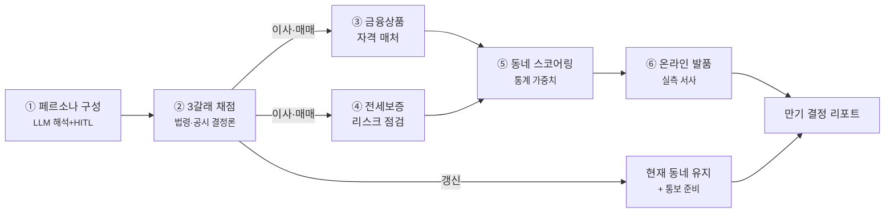
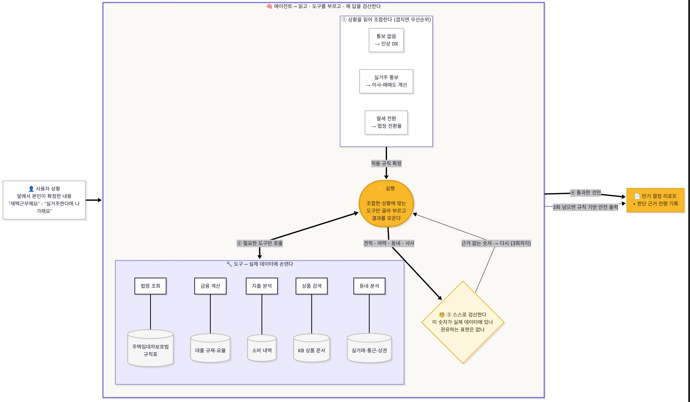
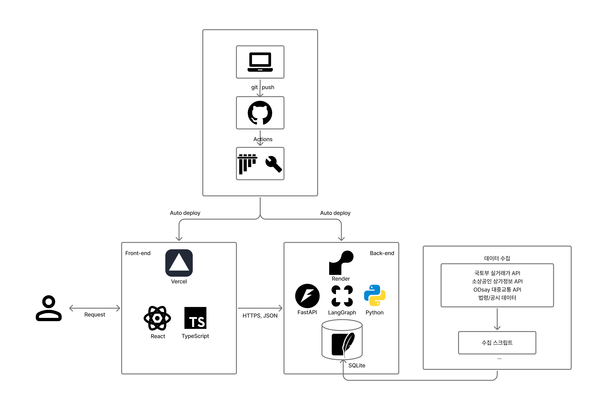

# KB만기.zip

**만기를 앞둔 임차인이 알 수 없는 세 가지 — 기준, 선택지, 감당 가능성 — 를
그 사람의 상황에 맞게 계산해 주고, KB의 상품과 부동산으로 실행까지 잇는
개인화 주거 결정 서비스입니다.**

KB국민은행 제8회 Future Finance AI Challenge

**🔗 시연: [kb-manggi-zip.vercel.app](https://kb-manggi-zip.vercel.app/)**

---

## 무엇이 문제인가

전세 만기 3주 전. 집주인은 5% 올려달라고 합니다. 올려주고 눌러앉는 게
나을까, 그 돈이면 대출을 조금 더 받아 아예 사는 게 나을까, 더 싼 동네로
옮기는 게 나을까.

이 결정 앞에서 임차인은 세 가지를 알 수 없습니다.

- **기준** — 법정 상한이 얼마인지, 통보기한이 지나면 어떻게 되는지,
  이 동네 실거래가 얼마인지. 모르면 부르는 값이 기준이 됩니다.
- **선택지** — 옮기면 월 얼마인지, 이참에 사면 가능한지. 계산해본 적 없는
  선택지는 없는 선택지입니다.
- **감당 가능성** — 그 선택이 내 소득과 지출에서 실제로 되는지.

이 정보 비대칭 위에서, 수천만 원이 걸린 2년간 되돌릴 수 없는 결정이
감으로 내려집니다. 이사를 '당하는' 이유 1위가 계약만기이고(비자발적 이사
사유 18.1%, 1인 가구 28.1% — 국토부 2024 주거실태조사), 임대차 분쟁은 전부
만기 시점 사건이며 그 비중은 26%에서 48%까지 커졌습니다(부동산원·LH
분쟁조정위 연차자료 자체 집계). 만기를 잘못 지나간 대가도 큽니다 — 보증금을
못 돌려받아 **임차권등기명령 신청이 2024년 47,353건으로 역대 최다**(2021년
7,631건의 6배), 2025년에도 28,044건이었고(법원 등기정보광장), HUG 전세보증
사고액은 2020~2024년 누적 약 11조 원 규모입니다(2024년 정점 4.5조, 국회
국토위 제출자료). 그리고 임차가구는 평균 3.6년마다 이 시험을 다시 봅니다.

세 선택지의 답은 전부 금융입니다 — 갱신의 인상분도, 이사의 전세대출도,
매매의 주담대도. 그래서 이 비대칭은 은행만 해소할 수 있습니다.

문진은 **숫자 몇 개(보증금·만기일·소득)와 자유입력 한 줄**로 끝냅니다.
"재택근무예요" 한 줄이면 충분합니다 — 그걸 읽고 해석하는 일이 AI의 몫이기 때문입니다.

## 어떻게 푸는가 — 한 사람의 여정




- **기준을 알려줍니다.** 갱신은 법정 상한 5%와 전월세전환율로 계산하고, 통보기한이 지났다면 **묵시적 갱신(동일 조건)이 원칙**임을 안내합니다 — 몰라서 5%를 올려주는 일을 막습니다.
- **선택지를 계산합니다.** 눌러앉으면 월 얼마, 옮기면 얼마, 사면 얼마까지 — 대출 규제(LTV·스트레스 DSR)와 KB 자체 여신정책, 정책상품 자격까지. 자격이 있는 정책상품은 차액도 병치합니다(자격 없으면 표시 안 함).
- **선택지를 실체로 만듭니다.** 예산 필터→개인 가중 순위로 동네를 좁히고, 그 동네의 하루를 실측 데이터로 미리 보여준 뒤 실매물은 **KB부동산으로 잇습니다**(발품을 대체하지 않고 좁힙니다).
- **감당 가능성을 판정합니다.** 최근 지출을 분석해 "월 부담이 변동지출 여력 안인지" 확인하고, 넘으면 넘는다고 말합니다.
- **한 장의 리포트와 KB 연결.** 상황·채점·동네·하루·여력을 한 장으로, 상담 예약 시 **계산이 그대로 창구에 전달**됩니다.

## 왜 AI가, 왜 이런 방식으로 필요한가

같은 "5% 올려달라"는 통보를 받아도 최선의 선택지는 사람마다 다릅니다 —
재택 1인에겐 이사가, 자녀 가구에겐 기준을 알고 갱신이, 자본 있는 신혼에겐
매매가. 상황의 조합은 폼으로 다 받을 수 없어서 **상황을 이해하는 일은
AI가** 합니다. 자유입력 한 줄을 해석하고, 입력끼리 모순되면 되묻습니다.
AI의 해석은 **정해진 4개 축의 배수로만** 출력되고, 어떤 제안도 **본인이
확인해야만** 반영됩니다(확인 전 신호는 어떤 계산에도 안 실림).

하지만 **돈 계산은 AI에게 맡기지 않습니다.** 대출 한도·월 상환액은 법령·공시의
규칙이 있고 틀리면 안 되는 숫자라, 계산은 전부 검증된 순수 함수가 합니다.
생성 문장의 숫자는 원본과 자동 대조를 통과해야 화면에 나가고, 전 과정은
노드 단위로 기록됩니다.

정리하면 — **이해와 설명은 AI가, 계산은 규칙이, 결정은 사람이.**



### 페르소나는 세 가지를 겹쳐 만듭니다 — 본인 말이 제일 셉니다

| 근거 | 예 | 어디서 |
|---|---|---|
| 본인이 말한 것 | "재택이라 통근은 덜 중요해요" | 자유입력 한 줄 + AI 해석 + **본인 확인** |
| 실제 소비 기록 | "카페 지출이 또래보다 뚜렷이 높음" | 최근 거래 내역 (시연: 합성 / 실서비스: 마이데이터) |
| 또래 평균 | "이 연령대는 배달·구독↑" | 카드소비 통계(지역 집계) |

**본인이 말한 게 제일 세고, 그다음이 실제 소비 기록, 마지막이 또래 평균**입니다.
또래 평균을 개인의 사실처럼 쓰지 않고 화면에 출처를 구분해 보여줍니다.
동네 가중치도 임의로 정한 게 아니라 **주거실태조사 이사 사유 응답률**에서
가져왔습니다(어떤 조사 항목이 어떤 축이 됐는지는 [docs/개인화_설계.md](docs/개인화_설계.md)에 표로).

## 은행은 무엇을 얻는가

임차인의 만기 D-90은 계약서에 날짜로 적힌, **은행이 아는 유일한 확정 미래**입니다.
세 선택지는 전부 KB 여신으로 귀결됩니다 — 갱신=증액 전세대출, 이사=신규
전세대출, 매매=주담대. 리포트를 받은 고객이 상담을 예약하면 소득·자격·한도가
**이미 계산된 여신 리드**로 창구에 도착하고, 타행 전세대출 고객의 만기는 대환
접점이 됩니다. 계산·체감·실행이 한 그룹 안에서 완결되는 구조는 KB만 만들 수 있습니다.

## 실행



```bash
# 백엔드 — API 키 없이도 폴백으로 전 기능 동작, 내장 demo 데이터로 오프라인 완주
cd backend && python3 -m venv .venv && source .venv/bin/activate && pip install -r requirements.txt
python scripts/refresh/seed_demo.py && uvicorn app.main:app --reload   # :8000
cd ../frontend && npm i && npm run dev                                  # :5173
```

- **프론트↔백엔드 전환**: `frontend/.env`의 `VITE_API_URL` 유무로 갈린다. 값이 있으면 그 백엔드에 fetch(위 명령처럼 로컬 `:8000`을 띄웠다면 자동 연동), 없으면 `engine/`·`data/`를 프론트가 직접 계산하는 오프라인 폴백(백엔드 없이도 데모 가능, 단 후보 동네가 9개짜리 축소 세트).
- **배포**: 실제 배포(SQLite 그대로)는 [DEPLOY.md](DEPLOY.md) 참고.

### 이 프로젝트를 가져다 쓰고 싶다면

1. **Fork → clone**. 위 "실행" 명령으로 로컬에서 먼저 띄워본다(키 없이도 폴백으로 전 기능 동작).
2. **키 채우기**(선택, 없어도 데모는 완주됨):
   - `backend/.env.example`을 `backend/.env`로 복사 후 채운다 — `ANTHROPIC_API_KEY`+`LLM_ENABLED=true`(AI 라이브), `MOLIT_API_KEY`(국토부 실거래 실시간 갱신 시).
   - `frontend/.env`에 `VITE_KAKAO_KEY`(지도), 원격 백엔드를 쓰려면 `VITE_API_URL`.
3. **직접 배포**하려면 [DEPLOY.md](DEPLOY.md) — Vercel(프론트) + Render(백엔드) 조합을 그대로 따라 하면 된다.
4. **바꿔야 할 데이터**: `backend/rules/*.yaml`(법령·공시 수치, 각 `checked_at`)와 `backend/data/`(지역 범위)가 이 프로젝트의 전제(서울 6구·동 82개)다. 다른 지역·최신 법령으로 쓰려면 이 두 곳부터 손본다.

## 더 깊이 보기

| 문서 | 내용 |
|---|---|
| [docs/아키텍처.md](docs/아키텍처.md) | 시스템 구성·처리 흐름·데이터 계층·안정성 장치 |
| [docs/에이전트_설계.md](docs/에이전트_설계.md) | LLM을 어디에·왜 썼나, 노드별 판단 주체, 자율 배제 |
| [docs/개인화_설계.md](docs/개인화_설계.md) | 페르소나 조립·증거 위계·crosswalk·개인화 실증 |
| [docs/서비스_흐름.md](docs/서비스_흐름.md) | 사용자 여정·화면·산출물·시나리오 3종 |
| [docs/](docs/) · [backend/rules/](backend/rules/) | 근거·검증 레퍼런스 / 모든 규칙과 출처·확인일 |

## 어떤 데이터를 어떻게 썼나

| 데이터 | 용도 | 출처 |
|---|---|---|
| 실거래 | 3갈래 시세·예산 필터·발품 사례 | 국토부 실거래가 공개 API(서울 6구·최근 6개월 스냅샷) |
| 통근 시간 | 동네 통근 점수 | ODsay 대중교통 경로(동 82개·대표 직장 4곳) |
| 상권(음식점·카페·마트) | 동네 생활·소비 점수 | 소상공인시장진흥공단 상가정보 |
| 대출 규제·정책상품·요율 | 3갈래 금융 계산 | 금융위·주택도시기금·HUG·한국은행·KB 공시(`rules/`) |
| 동네 가중치·문제정의 통계 | 스코어링 가중치 | 국토교통부 2024 주거실태조사 |
| 소비 성향(세그먼트) | 페르소나 기본값 | 경기데이터드림 카드소비 집계 |
| **개인 소비 내역** | 지출 여력 분석 | ⚙️ **합성 시연 데이터**(실서비스는 마이데이터 동의 후 실 내역) |

> 합성인 것은 **개인 소비 내역(마이데이터 자리)뿐**이며, 화면에도 그렇게 표기합니다. 나머지는 실측·공시 데이터이고, 실서비스 전환은 연동 지점(seam) 교체만 하면 됩니다.

## 한계와 로드맵

- 개인 지출·소비는 합성 시연 데이터입니다. 실서비스는 마이데이터 동의 후 실 내역으로 동일 분석.
- 소비→개인 중요도 추정 층은 **명시된 가설**이며, 선택 로그 축적 시 이산선택모형으로 검증합니다.
- 시세·동네는 PoC 범위(서울 6구·동 82개)이며 수집 파이프라인은 전국 확장 가능합니다.
- 산출물은 정보 제공이며 상품 권유가 아닙니다. 실제 조건은 금융기관 심사와 최신 공시에 따릅니다.
