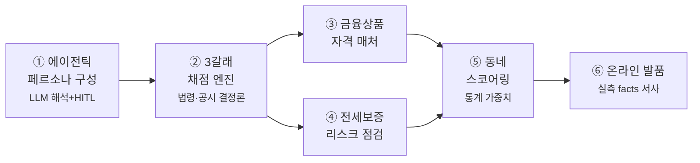

<div align="center">

# 🏠 KB 만기상담소

### 갱신 의사를 통보해야 하는 마지막 날. 오늘을 놓치면 선택지가 사라집니다.
**임차가구는 평균 3.4년마다 이 시험을 봅니다 — 눌러앉을까, 옮길까, 살까.**
세 갈래의 답은 전부 금융인데, 셋을 한 저울에 올려주는 곳은 없었습니다.

> **만기 임차인의 세 갈래를 근거 있게 채점하고,
> 고른 길의 하루를 미리 살아보게 하는 — 통제된 에이전틱 주거 결정 서비스**

`실거래 64,431건` · `규정 출처 100% + checked_at` · `HF 계산기 오차 0.6원`
`pytest 116 green` · `LLM 5노드 (판단2·통역3)` · `손계산 3케이스 대조`
`가중치 = 국토부 주거실태조사 도출` · `소비 프로필 = 카드소비 통계 도출 (임의값 0)`

*KB국민은행 제8회 Future Finance AI Challenge*

</div>

---

## 왜 이 문제인가

청년은 82.6%가 임차로 삽니다(국토부 2024 주거실태조사). 계약 만기는 평균 3.4년마다 돌아오고, 갱신 통보 기한(만기 6~2개월 전)을 놓치면 **선택지 자체가 사라집니다.** 그런데 이 결정의 세 갈래 —

| 🏠 눌러앉기 | 🚚 옮기기 | 🔑 사기 |
|---|---|---|
| 갱신 5% 룰? 갱신권? | 이 보증금으로 어디를? | 대출 껴서 가능한가? |
| → 법령·블로그에 흩어짐 | → 부동산 앱 | → 은행 (문턱 높음) |

셋의 공통 변수는 전부 **대출**입니다. 그래서 이 비교는 **은행만 완성할 수 있습니다.** KB는 여기에 자체 여신정책(주담대 3억 한도, 2026.7.10~)까지 반영합니다 — 외부 플랫폼이 원리적으로 흉내낼 수 없는 정확성입니다.

## 하나의 에이전틱 흐름 — 6대 기능



| # | 기능 | 무엇을 하나 | 근거 |
|---|---|---|---|
| ① | **에이전틱 페르소나 구성** | 문진+자연어("재택근무예요")를 AI가 해석, 사용자가 확정(HITL) | 프로필=카드소비 통계 도출, 조정=본인 진술 우선 |
| ② | **3갈래 채점 엔진** | 갱신·이사·매매를 비용+위험까지 같은 저울에 | LTV·DSR·KB 3억 캡·스트레스 DSR — 전 규칙 출처+checked_at |
| ③ | **금융상품 자격 매처** | 디딤돌·버팀목·KB 상품 자격을 결정론 판정 | 공시 원문 그대로 (재작성 0) |
| ④ | **전세보증 리스크 점검** | 반환보증을 '예측'이 아닌 '실거래 산수'로 — 전세가율(보증금÷매매 중위가) 구간 판정 + HUG 요율 월 환산 | HUG 담보인정비율 90% + 실거래 |
| ⑤ | **동네 스코어링** | 예산 하드필터 + 정량 가중합, 근거 전면 공개 | 가중치=주거실태조사 이사사유 응답률 정규화 |
| ⑥ | **온라인 발품** | 고른 동네의 하루를 서사로 — "직장까지 17분, 카페 237곳" | ODsay 실측·상권API·실거래 (지어낸 숫자 0) |

**기능④ 실제 예시 (실거래 나눗셈):**
```
응암동  전세가율 65% [여유]   (전세 중위 5.2억 ÷ 매매 중위 7.95억, 매매 536건 기준)
하월곡동 전세가율 56% [여유]   (252건 기준)   ·   표본 <5건이면 지표를 표시하지 않음(안 지어냄)
```
**기능② 실질 월 부담 (이중계산 없이 분해 표시):**
```
이사 · 실질 월 부담 (반환보증료 포함)  77만원
       이자·월세 71.9만 + 반환보증료 5.5만 포함
```

## AI는 어디서 일하는가 — "판단 2 + 통역 3"

> **"화려한 에이전트는 만들기 쉽습니다. 감사 가능한 에이전트가 어렵고, 은행에 필요한 건 후자입니다."**

KB가 2026년 7월 발표한 'KB AI Dev 센터'의 **하네스(Harness)** — AI를 쓰되 표준·보안을 자동 강제하고 사람이 최종 승인하는 통제 체계. 이 서비스는 그 철학의 **소비자 서비스 구현**입니다.

| 노드 | 역할 | 통제 장치 |
|---|---|---|
| 문진 명확화 (판단) | 자연어 해석·모순 되묻기 | 출력 축 제약·HITL 확정·키워드 폴백 |
| 상품 사유 (판단) | 자격 통과 상품의 "왜" | 자격 판정은 결정론, LLM은 사유만 |
| 브리핑·발품·문자 (통역) | 계산 결과 → 사람의 말 | 숫자 생성 금지, verify.py 대조 |
| 그 외 전부 | 계산·조회·라우팅 | **순수 함수** (LLM 0) |

- 한 여정 = 한 Langfuse Session (6노드 span에 input/output/규칙 스냅샷·가중치 조정 전→후·발품 facts·HITL 이벤트 기록 → 전 과정 감사 가능)

## 숫자를 믿을 수 있는 이유 — 3중 검증

1. **규칙값**: 법령·공시 원문 + `source_url` + `checked_at` → [`backend/rules/`](backend/rules/) · [`RESEARCH.md`](RESEARCH.md)
2. **산식**: HF 공적 계산기 대조 — 3.2억·2.85%·30년 → 월 1,323,383원, **오차 0.6원**
3. **구현**: 프론트 engine ↔ 백엔드 tools **동치 테스트** + 골든패스 3케이스 **손계산 전수 대조** → [`docs/검증_손계산대조.md`](docs/검증_손계산대조.md)

## 아키텍처 · 실행 · 데이터 출처

**전체 그림**: [`docs/서비스_E2E_아키텍처.md`](docs/서비스_E2E_아키텍처.md) · **구현 상세(실제 값)**: [`docs/구현_아키텍처_상세.md`](docs/구현_아키텍처_상세.md)

```
[프론트 React/Vite]  VITE_API_URL 스위치 (미설정→브라우저 engine / 설정→백엔드)
        ▼
[FastAPI + LangGraph]  intake → clarify → compare → route → persona → narrate
  tools(순수계산) · agents(LLM seam) · 🛡 Trust Layer(verify·Langfuse)
        ▼
[데이터]  SQLite(trades.db 실거래 64,431건 · 상권 · 통근) — 런타임 DB만 읽음(오프라인 완주)
          rules/*.yaml (법령·공시, 출처+checked_at)
```

```bash
# 백엔드 (키 없이도 전 기능 폴백 동작 · demo.db로 오프라인 완주)
cd backend && python3 -m venv .venv && source .venv/bin/activate && pip install -r requirements.txt
python scripts/refresh/seed_demo.py && uvicorn app.main:app --reload   # :8000
cd ../frontend && npm i && npm run dev                                  # :5173 (.env VITE_API_URL=http://localhost:8000)
```

**데이터 출처 (전 소스 URL은 rules/*.yaml · kb_products/*.md 프론트매터에)**

| 데이터 | 출처 | 쓰임 |
|---|---|---|
| 실거래 64,431건 (서울 6구) | 국토부 실거래가 공개 API | 3갈래 채점·동네 필터·전세가율·발품 |
| 대출 규제(LTV·DSR·KB캡) | 금융위 '26 가계부채 관리방안 · KB 공시 | 채점 엔진 |
| 갱신 5%·전월세전환율 4.75% | 주택임대차보호법 · 한국은행 | 갱신 계산 |
| 반환보증 요율·담보인정비율 90% | HUG 공시 | 전세보증 리스크 |
| 스코어 가중치 | 국토부 2024 주거실태조사 이사사유 | 동네 스코어링 |
| 소비 프로필 | 경기 카드소비 통계(2026-03) | 페르소나·발품 |
| 통근·상권 | ODsay 대중교통 · 소상공인시장진흥공단 | 발품 |

## 한계와 로드맵 (정직하게)

- 소비 프로필은 연령대 세그먼트 통계 근사 — 개인 실측은 마이데이터 연동(실서비스)
- 페르소나·시세는 PoC 범위(서울 6개 구) — 파이프라인은 전국 확장 가능 구조
- **전세가율**은 실거래 중위가 대비 참고 지표(선순위 미반영) — HUG 실제 심사는 선순위 채권+기관 산정 주택가격 기준
- 미구현: KB 상품 "적용 시 한도 델타" 병렬 제시 / 갱신 카드 전세가율(현 주소 미수집 — 실서비스에서 KB 전세대출 정보로 주소 자동 인지 시 확장) / clarify LLM 조정을 랭킹까지 배선
- 본 서비스는 **정보 제공이며 상품 권유가 아닙니다.** 실제 조건은 심사·계약에 따라 달라집니다. `rules/*.yaml` 규제·금리는 발표 직전 재확인.
