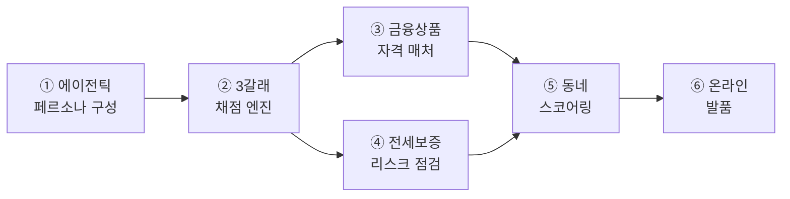

# docs 인덱스 (최신화: 2026-07-27)

> **KB 만기상담소** — 전월세 만기(D-90) 임차인에게 갱신·이사·매매 3갈래를 채점·비교하고,
> 고른 동네의 하루까지 보여준 뒤 KB 금융으로 잇는 에이전틱 상담 서비스.

## 🧩 6대 기능 = 하나의 에이전틱 흐름

| # | 기능 | 한 줄 (숫자·근거는 실측) |
|---|---|---|
| ① | 에이전틱 페르소나 구성 | 문진+자연어(clarify LLM)+HITL 확정 → 프로필. 근거=카드소비 통계 |
| ② | 3갈래 채점 엔진 | 갱신·이사·매매를 법령 결정론으로 채점(HF 계산기 오차 0.6원) |
| ③ | 금융상품 자격 매처 | 디딤돌·버팀목·KB 상품 자격 판정(KB 3억 자체 캡) |
| ④ | 전세보증 리스크 점검 | 반환보증을 '예측'이 아닌 '실거래 산수'로 — 전세가율(보증금÷매매 중위가) 구간 판정 + HUG 요율 월 환산 |
| ⑤ | 동네 스코어링 | 예산 하드필터 + 주거실태조사 가중치 가중합, 근거 공개 |
| ⑥ | 온라인 발품 | 고른 동네의 하루를 ODsay·상권·실거래로 서사화 |
> 각 기능의 실제 코드·값·정직성 표: **[구현_아키텍처_상세.md](구현_아키텍처_상세.md)**

> 상세 코드 gap은 `backend/STUBS.md`, 값 검증은 루트 `RESEARCH.md`.

## ⭐ 설명 문서 4종 (이것부터 · 심사·발표 소스)
| 문서 | 무엇 |
|---|---|
| [아키텍처.md](아키텍처.md) | 시스템 구성·요청 처리흐름(6노드)·데이터 계층·안정성 장치·PoC 범위 |
| [에이전트_설계.md](에이전트_설계.md) | LLM을 어디에·왜, 노드별 판단 주체, 자율 배제 이유, 계산 vs LLM 시간 대비 |
| [개인화_설계.md](개인화_설계.md) | 페르소나 조립·증거 위계·crosswalk(조사항목→축→가중치)·개인화 실증·한계 |
| [서비스_흐름.md](서비스_흐름.md) | 사용자 여정·화면별·산출물 3종·KB 연결·시나리오 3종 |

## 📚 근거·검증 레퍼런스
| 문서 | 무엇 |
|---|---|
| [STATUS.md](STATUS.md) | 현황·로드맵·핵심 결정 (세션 재개 시 여기부터) |
| [구현_아키텍처_상세.md](구현_아키텍처_상세.md) | 각 단계를 **실제 코드·값**으로 세분(리소스 스니펫·계산 계보·정직성 표) |
| [페르소나_축매핑_근거표.md](페르소나_축매핑_근거표.md) | 신호→축 반영 전수 + 근거 강도(✅/⚠️/🔴) |
| [선행연구_근거체계_총괄표.md](선행연구_근거체계_총괄표.md) | 축·수식·가중치·데이터 출처 전수 |
| [개인화체인_추적.md](개인화체인_추적.md) | 소비→페르소나→추천 체인 감사 추적(경계·정정 기록) |
| [검증_손계산대조.md](검증_손계산대조.md) | 골든패스 화면값 vs **손계산** 대조표 |
| [API.md](API.md) | 백엔드 엔드포인트 명세 (types.ts 계약) |

> 운영·방향 지시 문서는 **로컬 전용**(gitignore) — 반영 완료분이라 원격엔 두지 않음.

## 📂 ref/ (읽기 전용 근거)
- `KB_만기상담소_기획서_v6_2.md` — 기획 근거(수정 금지)
- `rules_확정값_실데이터반영용.md` · `잔여리서치_확정_0726.md` — 규정값 검증 원본
- `백엔드명세서_리서치반영_B1-5.md` · `리서치_TODO.md` — 명세·리서치

## 루트
- `README.md` — 프로젝트 개요·실행 · `CLAUDE.md` — 에이전트 수칙 · `RESEARCH.md` — 값 교체 체크리스트 · `backend/STUBS.md` — STUB·gap 전수
