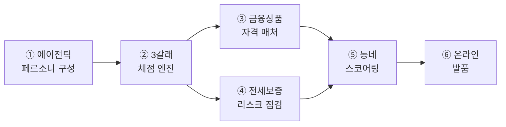

# docs 인덱스 (최신화: 2026-07-27)

> **KB 만기상담소** — 전월세 만기(D-90) 임차인에게 갱신·이사·매매 3갈래를 채점·비교하고,
> 고른 동네의 하루까지 보여준 뒤 KB 금융으로 잇는 에이전틱 상담 서비스.

## 🧩 6대 기능 = 하나의 에이전틱 흐름

| # | 기능 | 한 줄 (숫자·근거는 실측) |
|---|---|---|
| ① | 에이전틱 페르소나 구성 | 문진+자연어(clarify LLM)+HITL 확정 → 프로필. 근거=카드소비 통계 |
| ② | 3갈래 채점 엔진 | 갱신·이사·매매를 법령 결정론으로 채점(HF 계산기 오차 0.6원) |
| ③ | 금융상품 자격 매처 | 디딤돌·버팀목·KB 상품 자격 판정(KB 3억 자체 캡) |
| ④ | 전세보증 리스크 점검 | 반환보증을 '예측'이 아닌 '실거래 산수'로 — 전세가율(보증금÷매매 중위가) 구간 판정 + HUG 요율 월 환산 |
| ⑤ | 동네 스코어링 | 예산 하드필터 + 주거실태조사 가중치 가중합, 근거 공개 |
| ⑥ | 온라인 발품 | 고른 동네의 하루를 ODsay·상권·실거래로 서사화 |
> 각 기능의 실제 코드·값·정직성 표: **[구현_아키텍처_상세.md](구현_아키텍처_상세.md)**

> 상세 코드 gap은 `backend/STUBS.md`, 값 검증은 루트 `RESEARCH.md`.

## ⭐ 핵심 (이것부터)
| 문서 | 무엇 |
|---|---|
| [STATUS.md](STATUS.md) | 현황·로드맵·핵심 결정 한눈에 (세션 재개 시 여기부터) |
| [서비스_E2E_아키텍처.md](서비스_E2E_아키텍처.md) | ⭐**전체 그림의 정본** — 데이터→페르소나→계산→동네→발품, 왜 에이전틱인가 (mermaid) |
| [계산로직_및_아키텍처.md](계산로직_및_아키텍처.md) | 3갈래 계산 공식·규칙·출처 + 아키텍처 + **⭐에이전트 동작(에이전틱 vs 규칙)** |
| [개인화_파이프라인.md](개인화_파이프라인.md) | E2E §2·④·⑤의 **구현 편** — 리소스→명확화(HITL)→조합→산출물, 코드/노드/엔드포인트 |
| [팀원_온보딩_예시흐름.md](팀원_온보딩_예시흐름.md) | ⭐**처음 보는 팀원용** — 한 사용자 사례로 데이터 스키마→페르소나→계산→추천을 **실제 값**으로 끝까지 |
| [구현_아키텍처_상세.md](구현_아키텍처_상세.md) | E2E 각 단계를 **실제 코드·값**으로 세분(리소스 스니펫·페르소나 4단 논리·계산 계보·정직성 표). 심사+기술자용 |
| [검증_손계산대조.md](검증_손계산대조.md) | 골든패스 3케이스 화면값 vs **손계산** 대조표(발표 Q&A 대비) + 불일치 1건 |
| [에이전트_설계_로드맵.md](에이전트_설계_로드맵.md) | 왜 AI/에이전트·셀링포인트·MCP 불필요·로드맵·데이터 니즈 |
| [발표_골든패스_시나리오.md](발표_골든패스_시나리오.md) | **코드로 검증된** 완주 시나리오 + 골든패스(P2 매매) + 데모 리스크 |

## 🔧 가이드 (팀 작업·운영)
| 문서 | 무엇 |
|---|---|
| [API_키_발급_가이드.md](API_키_발급_가이드.md) | SBIZ·ODsay·TMAP·MOLIT 키 발급 + `.env` + 실행 |
| [지역데이터_채우기_가이드.md](지역데이터_채우기_가이드.md) | region_facts(상권 자동수집 + transport 수기) 채우기 |
| [API.md](API.md) | 백엔드 엔드포인트 명세 (types.ts 계약) |

> 방향 지시서(코드점검·ODsay·에이전틱강화·개인화스코어 등)는 **로컬 전용**(gitignore) — 반영 완료분이라 원격엔 두지 않음.

## 📂 ref/ (읽기 전용 근거)
- `KB_만기상담소_기획서_v6_2.md` — 기획 근거(수정 금지)
- `rules_확정값_실데이터반영용.md` · `잔여리서치_확정_0726.md` — 규정값 검증 원본
- `백엔드명세서_리서치반영_B1-5.md` · `리서치_TODO.md` — 명세·리서치

## 루트
- `README.md` — 프로젝트 개요·실행 · `CLAUDE.md` — 에이전트 수칙 · `RESEARCH.md` — 값 교체 체크리스트 · `backend/STUBS.md` — STUB·gap 전수
