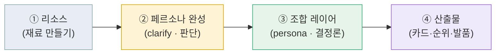
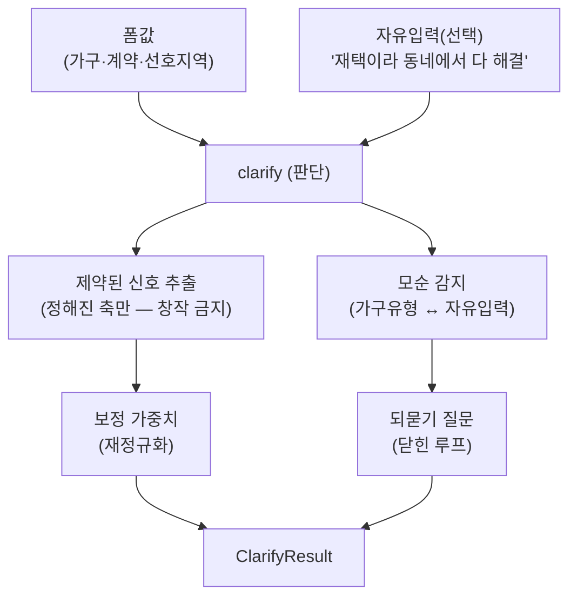
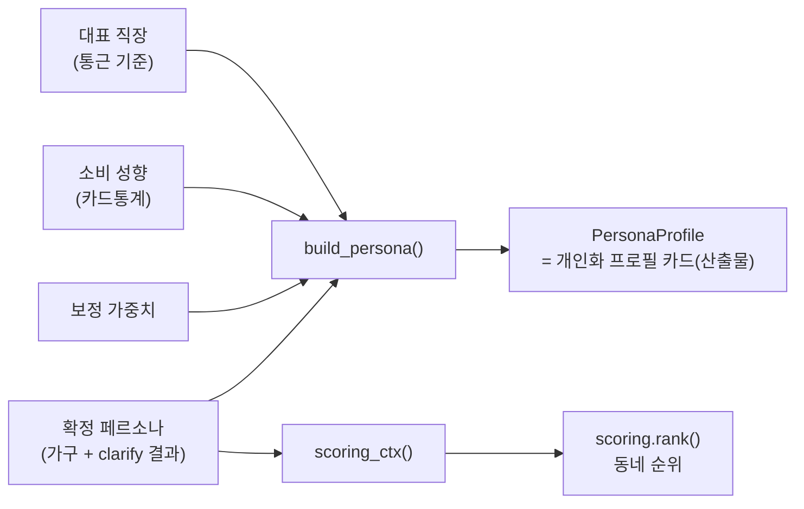
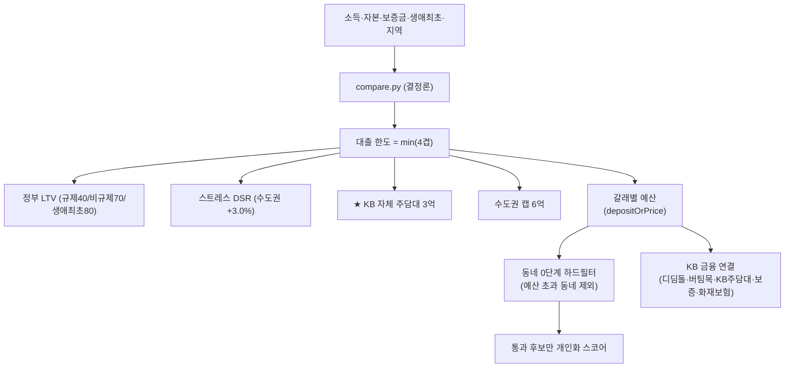
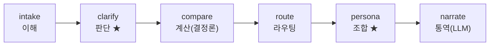

# 개인화 파이프라인 — 리소스에서 산출물까지

> **전체 그림(왜·데이터·에이전틱)은 [서비스_E2E_아키텍처.md](서비스_E2E_아키텍처.md)가 정본.**
> 이 문서는 그 중 개인화 파이프라인을 **실제 코드/노드/엔드포인트에 붙여** 설명하는 구현 편이다. (갱신: 2026-07-27)

핵심 원칙(종합명세 §5): **숫자·근거는 결정론 코드가, LLM은 서술만.** 개인화 전 구간 임의값 0 —
가중치는 국토부 조사, 소비 프로필은 카드통계에서 도출. 모든 근거는 화면에 노출한다(블랙박스 아님).

---

## 0. 한눈에 — 4단계



| 단계 | 무엇 | 어디 |
|---|---|---|
| ① 리소스 | 통계·실데이터 재료를 미리 적재 | `spending_profiles.yaml`(카드통계) · `trades.db`(국토부 실거래·상권·통근) · `scoring.SURVEY_RATIOS`(주거실태조사) · `rules/*.yaml`(법령) |
| ② 페르소나 완성 | 폼값 + 자유입력 → **제약된 해석 + 모순 되묻기** | `agents/clarify.py` (판단 노드) |
| ③ 조합 | 완성 페르소나 → 리소스를 **한 산출물로 조합** | `tools/persona.py` (결정론) |
| ④ 산출물 | 프로필 카드 · 동네 순위 · 발품 서사 | 프론트 `PersonaCard` · `scoring.rank` · `narrator` |

---

## 1. 리소스 (재료) — 무엇을 미리 만들어 두나

| 리소스 | 출처 | 성격 | 적재 위치 |
|---|---|---|---|
| 스코어 가중치 | 국토부 2024 주거실태조사 이사사유 응답률 | 통계 도출(감 아님) | `tools/scoring.py::SURVEY_RATIOS` |
| 소비 성향 | 경기 카드소비(2026-03, 연령 세그먼트) | 통계 도출 | `agents/spending_profiles.yaml` |
| 동네 상권 | 소상공인 상권 API(반경 집계) | 실집계 | `trades.db::region_facts` |
| 통근 실측 | ODsay 대중교통 | 실측(캐시) | `trades.db::region_transit` |
| 실거래 사례 | 국토부 실거래 64,431건 | 실데이터 | `trades.db::trades` |
| 법령·규정 | 주임법·금융위·HUG·지방세법 | 출처+checked_at | `rules/*.yaml` |

> 런타임은 DB/YAML만 읽는다(외부 API 미호출) — 발표장 네트워크가 끊겨도 완주.

---

## 2. 페르소나 완성 — `clarify` (판단 노드, 종합명세 §4-2 ★1순위)

폼값만으론 사람이 다 안 담긴다. 그래서 문진 말미 **자유입력(선택)**을 받아 판단 노드가 해석한다.



**안전장치 — "판단하되 창작하지 않는다":**
- 자유입력은 정해진 키워드 축(`_NOTE_MAP`: 통근/생활·소비/예산/선호)으로만 매핑. LLM을 켜도 **출력은 이 축들로 제약**.
- 모순은 사실 대조로만 감지 — 예: 가구="1인"인데 자유입력에 "아이 학군" → *"1인으로 선택하셨는데 자녀 언급이 있어요. 맞나요?"*
- **닫힌 루프**: 명확화 질문 → 사용자 확정 → 결정론 계산. 매 실행 같은 입력에 같은 답 → 재현·감사 가능(자율 계획과 본질적으로 다름, §4-5).
- **LLM 꺼도 동작**: 키워드 매핑 + 사실 대조는 순수 함수. LLM은 자연어 해석 폭을 넓히는 seam.

**HITL — "LLM은 제안, 반영은 사용자"(E2E §2):** clarify는 조정을 **제안만** 한다. 프론트 `RegionList`의 `ClarifyBanner`가
`[반영할게요 / 그대로 볼게요]`로 사용자에게 묻고, **확정한 경우에만** note 보정을 순위·가중치에 적용한다
(미확정이면 기본 가구 통계 기준). → LLM은 반영 권한이 없다.

**예시 (실제 실행값):**
```
입력: 가구=1인 · note="재택이라 동네에서 다 해결하고 카페 자주 가요"
→ noteSignals: ["재택·동네생활 중시 → 통근 가중치 절반·생활편의↑", "외식·카페 소비 성향 → 상권 매치↑"]
→ priorities:  생활·소비 > 통근 > 선호지역 > 예산   (재택이 통근을 절반으로 → 생활·소비가 1위로 역전)
```

---

## 3. 조합 레이어 — `tools/persona.py` (결정론)

이 파일이 생기기 전엔 리소스가 **흩어져** 각자 쓰였다(`scoring.weights_for`는 순위에서, `narrator.profile_for`는 발품에서 따로). `persona.py`가 "완성 페르소나 → 리소스 조합"을 **한 곳**에 모은다.



- `build_persona()` → **PersonaProfile**(세그먼트·headline·가중치·근거·조합 리소스·예산밴드) = 화면 카드.
- `scoring_ctx()` → 동네 스코어 입력 **단일 소스**. 자유입력 보정 가중치를 함께 실어 **명확화가 순위에 반영**된다.
- '빼기의 개인화'(§5-1): `resources`에는 **이 사람 하루에 실제 등장할 것만** 담는다(성향 안 맞는 씬 제외).

---

## 4. 예산은 어떻게 줄고 늘고, KB 상품과 어떻게 엮이나

개인화 이전에 **예산(=각 갈래로 갈 수 있는 금액)**이 먼저 결정론으로 잡힌다. 그 예산이 동네 후보의 **0단계 하드필터**가 된다.



- **예산을 늘리는 것**: 생애최초 LTV 80%, 정책대출(디딤돌·버팀목) 자격, KB 자체 3억 한도 → 갈 수 있는 동네가 늘어난다.
- **예산을 줄이는 것**: 스트레스 DSR, 규제지역 LTV 40%, 취득세·보증료 등 일회성 비용 → 실질 예산이 준다.
- **KB 상품 연관**: 예산을 만든 **바로 그 변수(대출)**가 KB 상품이다. 그래서 "이 예산이 이 상품에서 나왔다"를 그대로 근거로 노출(`basis`). 상품은 **나열이 아니라 예산 계산의 재료**로 등장 → 홍보가 아니라 계산.
- 안전: 산출물은 비교표지 "가입하세요"가 아니다. `verify.py`가 권유 표현을 차단.

---

## 5. 산출물 — 사용자가 실제로 받는 것

| 산출물 | 화면 | 무엇을 조합했나 |
|---|---|---|
| **개인화 프로필 카드** | `RegionList` 상단 `PersonaCard` | 세그먼트 + 우선순위 가중치(막대 + 근거) + 조합 리소스 태그 + 예산밴드 |
| **명확화 되묻기** | `RegionList` `ClarifyBanner` | 모순/추가확인 질문 + 반영된 입력 신호 |
| **동네 순위 + "왜 추천?"** | `RegionCard.scoreReasons` | 통근 실측 · 상권 매치 · 예산 여유(축별 근거) |
| **하루 발품 서사** | `SC-07` 이후 narrator | 통근+상권+실거래 facts를 LLM이 서술(숫자 생성 금지, verify 대조) |

**추천 ↔ 발품 일관성**: 스코어 상위 근거(예: 통근·카페)가 곧 발품 씬의 우선순위로 이어진다.

---

## 6. 에이전트 그래프 (LangGraph) — 6노드



- `★` = 이번에 추가된 노드(명확화·조합). Langfuse 한 trace에 nested → 발표 시 판단 경로 라이브 노출.
- LLM 경유: **판단 2(clarify·상품사유) + 통역 3(브리핑·발품·문자초안)**. 그 외 전 구간 결정론.

**엔드포인트 / 파일**
| 계약 | 백엔드 | 프론트 |
|---|---|---|
| `POST /api/clarify` → `ClarifyResult` | `agents/clarify.py` | `api.clarify()` (로컬 폴백 `engine/persona.ts`) |
| `POST /api/persona` → `PersonaProfile` | `tools/persona.py` | `api.persona()` |
| `GET /api/regions?...&note=` | `graph.regions_node` → `persona.scoring_ctx` → `scoring.rank` | `api.regions(...)` |
| `POST /api/analyze` | 6노드 그래프(clarify·persona 포함) | `api.analyze()` |

> 스키마는 `schemas.py` ↔ `types.ts` 1:1(`ClarifyResult`·`PersonaProfile`·`ContractInfo.note`).

---

## 7. 아직 seam인 것 (정직한 구분)

- **개인 실소비**(마이데이터·KB카드) → PoC는 연령 세그먼트 근사. 실서비스 해자.
- **clarify LLM 해석** → 지금은 키워드 축 매핑(결정론). LLM_ENABLED 켜면 자연어 해석 확장(출력은 여전히 축 제약).
- **HITL 확정** → 자유입력 조정은 `[반영할게요/그대로 볼게요]`로 확정·반영까지 구현됨(E2E §2). 단 **모순(가구유형) 정정은 아직 폼 back 필요** — 배너에서 바로 고치는 인라인 수정은 다음 단계.
- **KB 상품 '적용 시 한도 델타' 병렬 제시**(E2E §4) → 아직 미구현. `compare.py`(엔진 동치 테스트)를 건드려야 해 별도 작업으로 분리.
- **정확한 직장 입력** → 지금은 가구 유형 기준 대표 직장(가정). 폼 필드/마이데이터로 교체 시 통근 실측 정확도↑.
