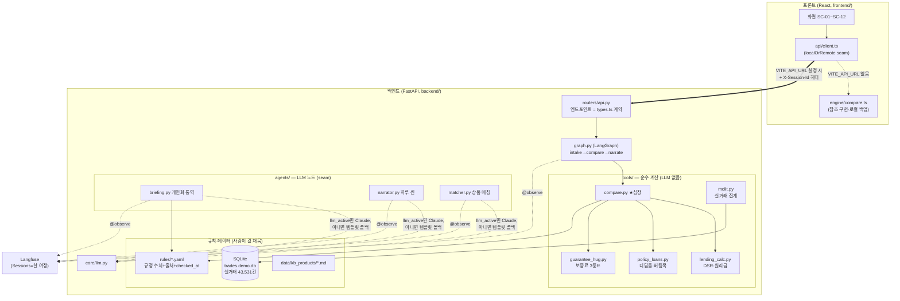
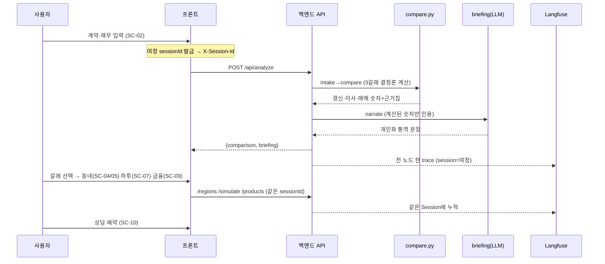
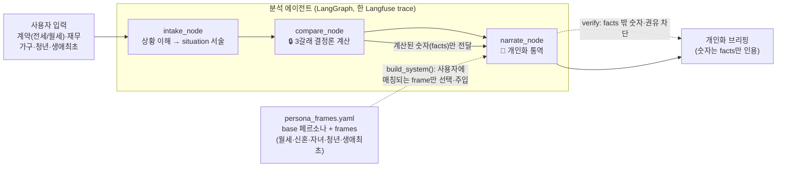
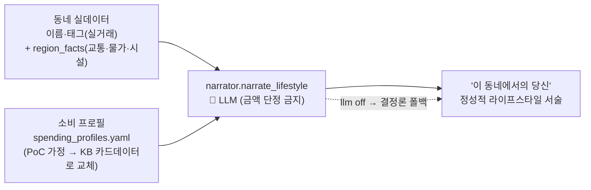
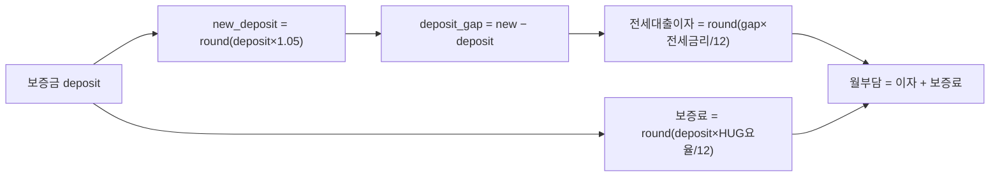
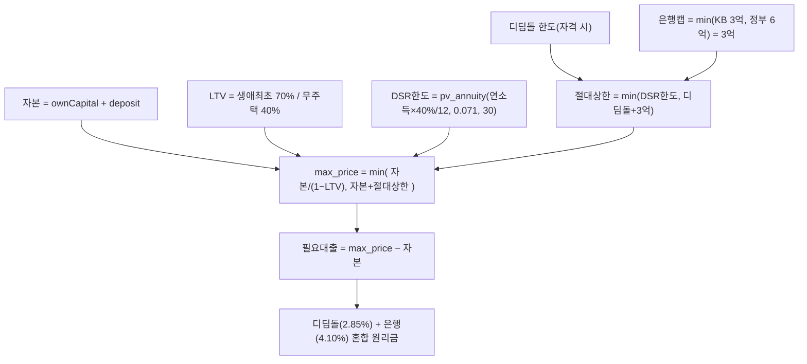
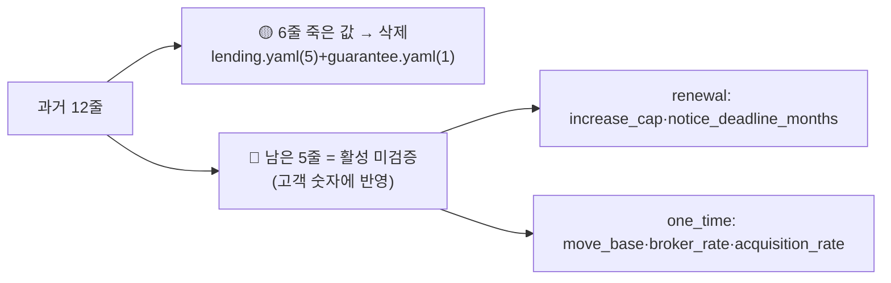

# KB 만기상담소 — 계산 로직 & 아키텍처 (근거 산출의 모든 것)

> 이 문서 하나로 **"어떤 흐름으로 돌고, 각 갈래(갱신·이사·매매)의 숫자가 어떤 공식·규칙값·법령 근거에서 나와 고객에게 주어지는지"** 를 빠짐없이 설명한다.
> 처음 보는 심사위원이 읽어도 "이 숫자는 이래서 나왔구나"가 되도록 쓴다. (갱신: 2026-07-26)

---

## 0. 한 줄 원칙 — 왜 믿을 수 있나

> **숫자는 결정론 코드가, 말은 LLM이.** 모든 규정 수치는 `rules/*.yaml` 한 곳에 `source_url`·`checked_at`과 함께 있고, LLM은 그 **계산된 숫자만 인용**해 상황에 맞게 설명한다. 지어낸 숫자는 0.

이게 이 서비스의 신뢰 축(Trust Layer)이다. 아래 모든 계산은 LLM이 개입하지 않는 순수 함수(`tools/`)이고, 프론트 참조 구현(`engine/compare.ts`)과 **원 단위 오차 0**으로 일치하도록 테스트가 강제한다.

---

## 1. 시스템 아키텍처

**핵심 seam 3개** (전부 "키/변수 하나로 실체 교체"):
| seam | 스위치 | 꺼짐(데모 백업) | 켜짐(실서비스) |
|---|---|---|---|
| 프론트↔백 | `VITE_API_URL` | `engine/`·`data/` 직접 호출 | 백엔드 API로 fetch |
| LLM | `LLM_ENABLED`+`ANTHROPIC_API_KEY` | 템플릿 폴백 | 실 Claude |
| 실거래 | `data/trades.demo.db` | 커밋된 스냅샷 | refresh 스크립트로 국토부 API 재수집 |

---

## 2. 한 사용자 여정 (데이터 흐름)

---

## ⭐ 에이전트는 어떻게 동작하나 — 에이전틱 vs 규칙기반 (심사 핵심)

> 이 서비스의 정체성: **"돈(숫자)은 결정론 코드가, 이해와 통역은 LLM이."** 아래가 "왜 에이전틱한가"와 "왜 안전한가"의 한 장 요약이다.

### A. 경계 — 어디가 LLM이고 어디가 규칙인가 (정직하게)

| 레이어 | 방식 | 왜 이렇게 |
|---|---|---|
| 계산 (`compare.py`) | 🔒 **규칙 결정론** | 금융 정확도·감사·환각 0 |
| 데이터 (실거래·규정) | 🔒 **규칙** (파라미터 SQL·YAML) | 정확·안전·재현 (LLM이 SQL 짜면 위험) |
| 상황 이해 (`intake`) | 🔒 **규칙** (contract·finance → 상황 문자열) | 결정론이면 충분 |
| 페르소나 선택 (`frames` 매칭) | 🔒 **규칙** (조건 매칭) | 재현·설명가능 |
| **통역·발품 생성 (`narrate`)** | 🤖 **LLM** | 같은 숫자·동네를 *그 사람 언어로* — 규칙으로 열거 불가 |
| **출력 자기검증 (`verify`)** | 🤖 **LLM 루프** | facts 밖 숫자·권유 감지 → 재생성 |
| 오케스트레이션 | LangGraph + Langfuse | 흐름을 추적가능하게 |

> **가장 정직한 진단**: 이 서비스는 "에이전틱을 위한 에이전틱"을 하지 않는다. 흐름의 **대부분은 결정론**이고, LLM은 **딱 두 곳 — ① 개인화 통역/발품 생성, ② 출력 자기검증(재생성 루프)** 에만 쓴다. 강한 의미의 자율 멀티에이전트가 아니다. **이건 결함이 아니라 의도** — 금융은 예측가능성이 생명이라, LLM에게 맡겨도 안전한 지점에만 맡긴다.

### A-2. 그래서 "에이전틱"이라 부를 근거는? (정직하게 2가지)
1. **자기검증 루프 (`verify` → 재생성)** — LLM이 만든 문장을 규칙으로 검사(facts 밖 숫자·권유)하고, 걸리면 **스스로 다시 생성**한다(최대 2회, `core/verify.py`). "판단 → 행동 → 결과 검사 → 재시도"는 에이전트의 핵심 루프.
2. **상황 적응형 통역** — 같은 계산 결과라도 사용자 상황(월세·신혼·청년…)에 따라 **주입되는 관점(frames)·소비 프로필이 달라져** 다른 산출물이 나온다. (관점 선택은 규칙, 문장 생성은 LLM)

3. **supervisor 라우팅** (`agents/supervisor.py`, graph `route` 노드) — ✅ 구현됨. "어떤 규칙 세트(주택유형)를 쓸지 + 어떤 갈래가 현실적인지"를 판단(결정론). 분석 그래프 = **intake→compare→route→narrate 4노드**. 경우의 수(오피스텔 등) 확장 시 라우터가 규칙 세트를 분기 → "왜 에이전트"의 실체. (자세히: `docs/에이전트_설계_로드맵.md`)

> **왜 이게 "라우팅"이 핵심인가**: 각 경우의 규칙값(오피스텔 취득세 등)은 **사람이 리서치해 인코딩**(에이전트가 지으면 할루시네이션 = 금지). 에이전트는 **그중 무엇을 적용할지 선택**만 한다. 경우의 수가 폭발할수록 하드코딩 if문보다 라우터가 확장 우위 — 이것이 정직한 "왜 에이전트".

### B. 왜 굳이 에이전틱해야 하나 (한 문장)

> **계산 자체는 스프레드시트도 한다. 차별점은 "이 결정이 당신에게 무엇을 의미하는지"를 임의의 페르소나(월세·신혼·청년 vs 전세·다자녀·무주택)에 맞춰 통역하는 것 — 규칙으로 열거 불가능해서 LLM이 필요하다.**

### C. 페르소나 파이프라인 — 어디서 어떤 리소스를 넣나

동작 예 (같은 계산, 다른 통역):
- **월세·신혼·청년** → `build_system`이 3개 frame 주입("월세=사라지는 돈" + "신혼 자산형성" + "청년 정책대출") → 그 관점으로 통역.
- **전세·무주택·생애최초** → 다른 frame("생애최초 LTV 우대") → 다른 톤.
- 숫자는 언제나 `compare_node` 산출물만 인용 — narrate는 숫자를 **못 지어낸다**(verify 가드레일).

> 코드 위치: 페르소나 선택 = `agents/briefing.py::build_system` + `agents/persona_frames.yaml`. 계산 = `tools/compare.py`. 오케스트레이션 = `graph.py::build_analyze_graph`.

### D. "안전한 에이전트" = Trust Layer 3겹

1. **숫자 결정론** — `compare`는 순수함수, 프론트 참조구현과 **원 단위 오차 0**(테스트 강제). 같은 입력 = 같은 출력.
2. **가드레일** — LLM 출력에서 facts 밖 숫자·권유 표현 감지 → 재생성 (`core/verify.py`).
3. **관측성** — 전 노드 Langfuse `@observe`, **한 사용자 여정 = 한 Session** → "이 답이 어떤 경로로 나왔나" 재생 가능.

→ 즉, **LLM에게 판단·통역은 맡기되 돈은 절대 못 만지게 한** 구조. 금융에서 생성형 AI를 쓰는 올바른 방법.

### E. "온라인 발품" 개인화 하루 (KB 소비데이터 훅)

하루 시뮬(SC-07) 마지막에 **'💬 이 동네에서의 당신'** — 그 동네에서의 하루를 사용자 **소비 패턴에 맞춰** 생성형으로 그려준다. (계산기와의 차별점이 눈에 보이는 지점)

- **입력 = 동네 실데이터 + 소비 프로필**. 금융 숫자는 안 만든다(정성적 서술만) → Trust Layer 유지.
- **두 개의 seam(갈아끼우기)**:
  - `agents/spending_profiles.yaml` — PoC는 가구별 가정 프로필. **실서비스는 KB 카드/소비 데이터로 파일만 교체**(같은 shape) = KB만의 해자.
  - `data/region_facts.yaml` — 동네 대표 정보(교통·물가·시설). 팀원이 채우는 seam(채우기 가이드: `docs/지역데이터_채우기_가이드.md`). 비면 이름+태그만으로 생성.
- 코드: `agents/narrator.py::narrate_lifestyle`. 도달: `/api/briefing` `kind=dayPlayer`(스키마 변경 없음).

---

## 3. 세 갈래 계산 — 공식·규칙값·출처 (빠짐없이)

입력: **계약**(전세/월세, 보증금 `deposit`, 월세 `monthlyRent`, 만기일, 갱신권 사용여부) + **재무**(자기자본 `ownCapital`, 연소득 `annualIncome`, 생애최초 `firstHome`, 만35세미만 `under35`, 가구 `household`).
반올림은 전부 `js_round(x)=floor(x+0.5)` (JS `Math.round` 동치). 코드 위치: `backend/app/tools/compare.py`.

### 3-0. 공통 프리미티브 (`lending_calc.py`)

| 함수 | 공식 | 용도 |
|---|---|---|
| `annuity_payment(P,r,y)` | `P·(r/12) ÷ (1−(1+r/12)^(−12y))` | 원리금균등 **월 상환액** |
| `pv_annuity(pmt,r,y)` | `pmt·(1−(1+r/12)^(−12y)) ÷ (r/12)` | 월상환 → 감당 **원금**(한도 역산) |
| `effective_dsr_rate` | `base + stress×base_ratio×loan_type_ratio` | DSR **한도 산정용** 금리 |
| `dsr_loan_limit` | `pv_annuity(연소득×DSR상한/12 − 기존부채, 산정금리, 30)` | DSR 한도액 |

> **금리 용도 분리(중요)**: **한도 산정**엔 스트레스 포함 금리(`0.041+0.030=0.071`), **월 상환 표시**엔 base 금리(`0.041`)를 쓴다. 스트레스 금리로 월상환을 보여주면 부담이 과대계상되기 때문. (검증 앵커: `annuity_payment(3.2억, 2.85%, 30)=1,323,383원`, HF 계산기 일치)

### 3-1. 갱신 (눌러앉기)

| 항목 | 공식 | 규칙값 (출처) |
|---|---|---|
| 새 보증금 | `round(deposit × (1+0.05))` | `renewal.increase_cap = 0.05` — 주택임대차보호법 법정 상한 🔴 |
| 증액분 | `max(0, new − deposit)` | — |
| 증액분 전세대출 이자 | `round(gap × jeonse_rate/12)` | `jeonse_rate` = 버팀목 청년(자격 시) 또는 `0.0389`(HF 공시 은행평균) ✅ |
| 반환보증료(월) | `round(deposit × guarantee_rate(deposit)/12)` | HUG 3중표 ✅ (아파트·부채80%↓ 기준 0.115~0.128%) |
| 월세→보증금 환산 | `round(월세×12 / 0.0475)` | `renewal.conversion_rate = 0.0475` ✅ — 전월세전환율(기준금리 2.75%+2%p, 2026-07-26) |
| 근거칩(고객노출) | `["법정 상한 5%", "HUG 공시 요율"]` | — |

### 3-2. 이사 (전세로 옮기기)

| 항목 | 공식 | 규칙값 (출처) |
|---|---|---|
| 전세대출 가능액 | `min(round(deposit×0.80), 222,000,000)` | `jeonse_limit.ratio=0.80`·`base=2.22억` — KB 전세자금대출 ✅ |
| 새 전세 예산 | `deposit + 대출가능액` | — |
| 대출이자(월) | `round(대출×jeonse_rate/12)` | 위 전세금리 ✅ |
| 반환보증료(월) | `round(예산×guarantee_rate(예산)/12)` | HUG 3중표 ✅ |
| 일회성 비용 | `round(1,500,000 + deposit×0.004)` | `one_time.move_base`(이사비)·`broker_rate=0.004`(중개보수) 🔴 |
| 근거칩 | `["전세대출 한도 80%", "실거래 기준"]` | — |

### 3-3. 매매 (내 집 사기, 수도권 규제지역 가정)

| 항목 | 공식 | 규칙값 (출처) |
|---|---|---|
| 자본 | `ownCapital + deposit` | (전세보증금 회수분 포함) |
| LTV | 생애최초 `0.70` / 무주택 `0.40` | `lending_regulated.ltv` — 금융위 '26 가계부채방안 ✅ |
| DSR 산정금리 | `0.041 + 0.030×1.00×1.00 = 0.071` | base 4.10% + 스트레스 3.0%(수도권) ✅ |
| DSR 한도 | `pv_annuity(연소득×0.40/12, 0.071, 30)` | `dsr.cap=0.40` ✅ (기존부채 0 가정) |
| 디딤돌 한도·금리 | 자격 판정 → 한도(일반2억/생애최초2.4억/신혼·2자녀3.2억), `rate 2.85%` | `policy_loans.didimdol` — 주택도시기금 ✅ |
| 은행 절대캡 | `min(KB 3억, 정부 6억)=3억` | `mortgage_cap` ✅ (2026.7~ KB 정책) |
| 최대 집값 | `min(자본/(1−LTV), 자본+min(DSR한도, 디딤돌+3억))` | `solve_max_price` |
| 월 상환 | `round(annuity(디딤돌분,2.85%,30)+annuity(은행분,4.10%,30))` | **표시용 base 금리** ✅ |
| 취득세 등 | `round(max_price×0.011)`, 생애최초면 `−200만`(하한 0) | `acquisition_rate=0.011` 🔴 + `first_home_acq_reduction=2백만` ✅(2028까지, 지특법 §36의3) |
| 근거칩 | `["규제지역 LTV X%", "KB 한도 3억", "스트레스 DSR 가산 3.0%", (+"디딤돌 혼합")]` | — |

### 3-4. 고객에게 함께 노출되는 "가정(assumptions)" 문구
계산 카드 밑에 항상 표시 → 심사위원·고객이 전제를 바로 확인:
`전세대출 금리 HF 공시 평균 3.89%` · `규제지역 LTV 40%(생애최초 70%)` · `KB 주택구입 대출 한도 3억(2026.7~)` · `스트레스 DSR 수도권 3.0%(한도 산정에만)` · `보증료 HUG 공시 요율(아파트·부채80%↓ 가정)` · `기존 대출 0 가정` · (firstHome '모름' 시) `생애최초면 LTV 70%까지 가능` · `법정 상한 5%`.

---

## 4. 규칙값 출처 대장

### ✅ 검증 완료 (2026-07-20, `ref/rules_확정값_실데이터반영용.md` 셀 대조)
| 파일 | 값 | 출처 |
|---|---|---|
| `lending_regulated.yaml` | LTV·DSR·스트레스·KB/정부 캡·전세금리·전세한도 | 금융위 '26 가계부채방안 / KB / HF 공시 |
| `policy_loans.yaml` | 디딤돌·버팀목 소득/한도/금리 | 주택도시기금 |
| `guarantee_hug.yaml` | HUG 반환보증 요율 3중표 | HUG 공시 |
| `data/kb_products/*.md` | 상품 7종 출처·checked_at | KB 상품 공시 |

### ✅ 추가 확정 (2026-07-26, `ref/잔여리서치_확정_0726.md`)
- **전월세전환율 0.055 → `0.0475`**: 2026.7.16 한은 기준금리 인상(2.50→2.75%) → 법정 "기준금리+2.0%p". 렌트홈 계산기 확인. → 월세(P3) 환산액에 직접 반영.
- **생애최초 취득세 감면 = 적용 확정**: 2028.12.31까지 연장(지특법 §36의3), 12억↓ 200만. compare가 firstHome '예'에 이미 -200만 적용 중 → 근거 확정.

### 🔴 아직 미검증 (사람이 조사해 채울 것) — **compare에 실제 반영되는 값**
아래 5개는 지금 예시값이고 고객 숫자에 직접 들어간다. 서버 시작 시 경고로도 뜬다(§5). (`RESEARCH.md` A1·A3·A10~A12)

| 파라미터 (파일) | 현재값 | 무엇 | 어디서 확인 |
|---|---|---|---|
| `increase_cap` (renewal) | 0.05 | 계약갱신 인상률 상한 | 국가법령정보센터 주택임대차보호법 |
| `notice_deadline_months` (renewal) | 2 | 갱신 통보 기한(만기 N개월 전) | 주택임대차보호법 |
| `move_base` (one_time) | 1,500,000 | 이사 기본비 | 시세 참고치 |
| `broker_rate` (one_time) | 0.004 | 중개보수 요율 | 공인중개사법 시행규칙(구간표) |
| `acquisition_rate` (one_time) | 0.011 | 취득세 기본요율 | 지방세법(가액구간) |

---

## 5. ⚠️ uvicorn 시작 WARNING 해설 — 정리 완료 (12 → 5줄)

서버 켜면 뜨는 `규칙 미검증: … (checked_at 없음)` 경고는 **버그가 아니라 설계된 신뢰 장치**다. `core/rules.py::_value()`가 `checked_at: null`인 값을 로드할 때마다 "제출 전 사람이 법령 검증하라"고 **일부러** 찍는다.

**2026-07-26 정리**: 예전엔 12줄이 떴는데, 그중 6줄은 **이미 검증본으로 대체돼 아무도 안 쓰던 죽은 값**(구 `lending.yaml`·`guarantee.yaml`)이라 오해를 줬다 → 두 파일을 **삭제**하고 `get_rules`에서 로딩 제거. 이제 **5줄만** 뜨고, 그 5줄은 전부 **진짜 미검증 활성값**이다.

| 남은 경고(5) | 영향 | 조치 |
|---|---|---|
| `renewal.yaml` increase_cap, notice_deadline_months | 갱신 숫자 | §4 🔴 표대로 법령 확인 후 `checked_at` 채우기 |
| `one_time.yaml` move_base, broker_rate, acquisition_rate | 이사·매매 숫자 | 〃 |

> 참고: `renewal.conversion_rate`는 2026-07-26 검증(0.0475)되어 경고에서 빠졌다. 대출/보증 규제값(LTV·DSR·전세금리·보증료)은 애초에 검증본 `lending_regulated.yaml`·`guarantee_hug.yaml`에서 직접 로드하므로 경고 대상이 아니다.

---

## 6. "수식 제대로 반영했나 / 심사위원이 납득하나" — 근거

- **동치 테스트**: `tests/test_compare_equivalence.py` — 프론트 참조 구현 `engine/compare.ts`와 백엔드 `compare.py`가 **전 필드 원 단위 오차 0**. (fixtures는 프론트를 UTC로 실행해 생성 → 백엔드가 맞춤)
- **앵커 테스트**: 원리금 공식이 HF 공식 계산기와 일치(3.2억·2.85%·30년 = 1,323,383원).
- **결정론**: 세 갈래 숫자는 LLM 무개입 순수함수. 같은 입력 → 같은 출력.
- **투명성**: 모든 값에 `source_url`·`checked_at`, 화면에 근거칩·가정 문구, 불확실 입력(예: firstHome '모름')은 "불확실성 칩"으로 명시.
- **관측성**: 한 여정이 Langfuse **Sessions** 하나로 묶여 intake→compare→narrate 경로가 그대로 보임.

→ 심사위원이 "이 숫자 왜?"라고 물으면 **공식(§3) + 규칙값 출처(§4) + 화면 근거칩** 세 겹으로 답이 나온다.

---

## 7. 정직한 PoC 가정 (한계 명시)

동작하지만 단순화한 지점 (자세히는 `backend/STUBS.md` D·E절):
- 매매 지역 = **수도권 규제지역 고정 가정** (데모 동네가 전부 서울).
- 기존 대출 = 0, DSR 대출유형 = 변동(가장 보수적), 무주택 = 참 가정.
- HUG 보증료 = 아파트·부채비율 80%↓ 가정(주택유형 입력 없음).
- 중개보수·취득세 = 단일 요율(구간표 아님) — §4 🔴 리서치로 정밀화 예정.
- 스트레스 혼합·주기형 비율 = 원문 미확보 → 보수적 1.00(한도 과소추정 = 안전).

> 이 가정들은 전부 화면 assumptions·근거칩에 노출되거나 STUBS에 기록돼 있다. "숨긴 근사"는 없다.
