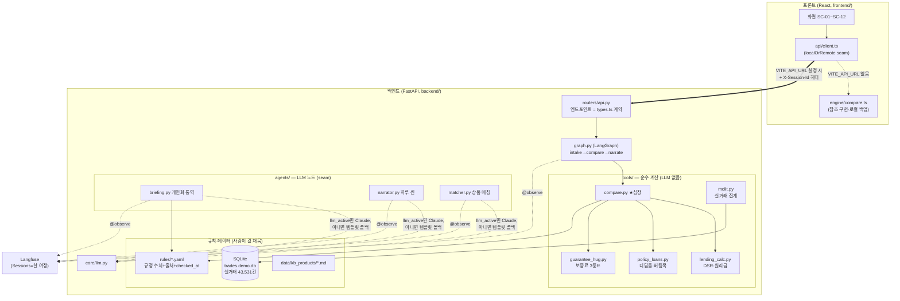
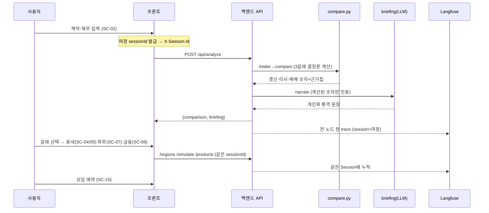
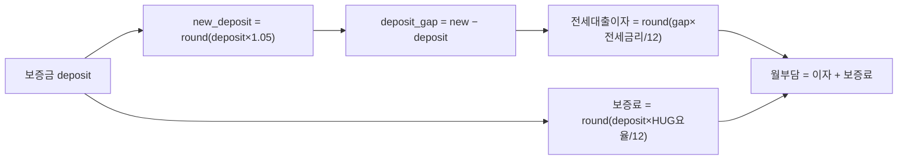
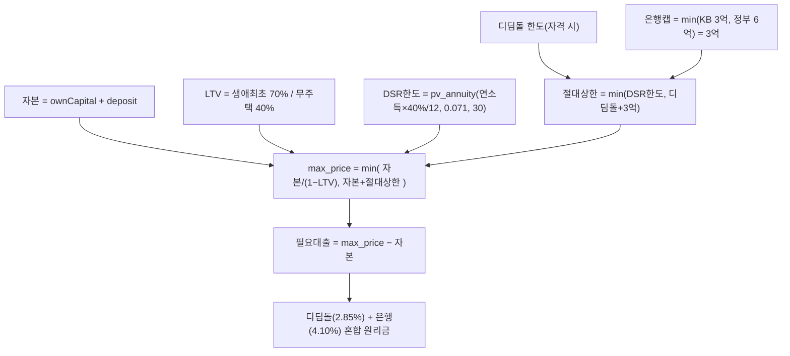
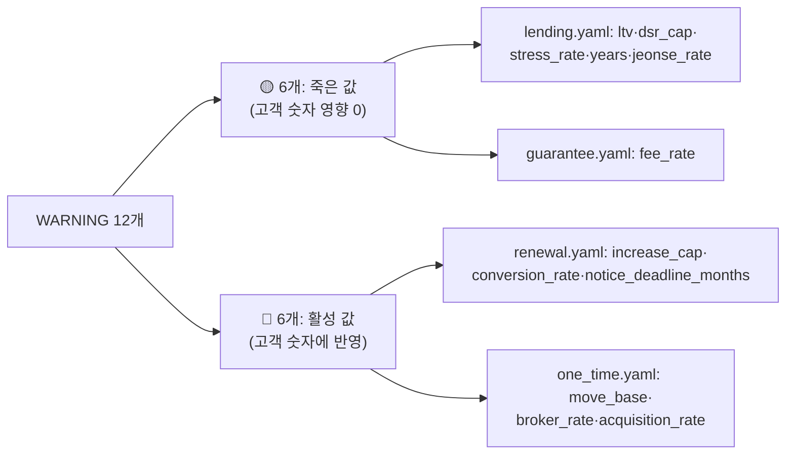

# KB 만기상담소 — 계산 로직 & 아키텍처 (근거 산출의 모든 것)

> 이 문서 하나로 **"어떤 흐름으로 돌고, 각 갈래(갱신·이사·매매)의 숫자가 어떤 공식·규칙값·법령 근거에서 나와 고객에게 주어지는지"** 를 빠짐없이 설명한다.
> 처음 보는 심사위원이 읽어도 "이 숫자는 이래서 나왔구나"가 되도록 쓴다. (갱신: 2026-07-26)

---

## 0. 한 줄 원칙 — 왜 믿을 수 있나

> **숫자는 결정론 코드가, 말은 LLM이.** 모든 규정 수치는 `rules/*.yaml` 한 곳에 `source_url`·`checked_at`과 함께 있고, LLM은 그 **계산된 숫자만 인용**해 상황에 맞게 설명한다. 지어낸 숫자는 0.

이게 이 서비스의 신뢰 축(Trust Layer)이다. 아래 모든 계산은 LLM이 개입하지 않는 순수 함수(`tools/`)이고, 프론트 참조 구현(`engine/compare.ts`)과 **원 단위 오차 0**으로 일치하도록 테스트가 강제한다.

---

## 1. 시스템 아키텍처

**핵심 seam 3개** (전부 "키/변수 하나로 실체 교체"):
| seam | 스위치 | 꺼짐(데모 백업) | 켜짐(실서비스) |
|---|---|---|---|
| 프론트↔백 | `VITE_API_URL` | `engine/`·`data/` 직접 호출 | 백엔드 API로 fetch |
| LLM | `LLM_ENABLED`+`ANTHROPIC_API_KEY` | 템플릿 폴백 | 실 Claude |
| 실거래 | `data/trades.demo.db` | 커밋된 스냅샷 | refresh 스크립트로 국토부 API 재수집 |

---

## 2. 한 사용자 여정 (데이터 흐름)

---

## 3. 세 갈래 계산 — 공식·규칙값·출처 (빠짐없이)

입력: **계약**(전세/월세, 보증금 `deposit`, 월세 `monthlyRent`, 만기일, 갱신권 사용여부) + **재무**(자기자본 `ownCapital`, 연소득 `annualIncome`, 생애최초 `firstHome`, 만35세미만 `under35`, 가구 `household`).
반올림은 전부 `js_round(x)=floor(x+0.5)` (JS `Math.round` 동치). 코드 위치: `backend/app/tools/compare.py`.

### 3-0. 공통 프리미티브 (`lending_calc.py`)

| 함수 | 공식 | 용도 |
|---|---|---|
| `annuity_payment(P,r,y)` | `P·(r/12) ÷ (1−(1+r/12)^(−12y))` | 원리금균등 **월 상환액** |
| `pv_annuity(pmt,r,y)` | `pmt·(1−(1+r/12)^(−12y)) ÷ (r/12)` | 월상환 → 감당 **원금**(한도 역산) |
| `effective_dsr_rate` | `base + stress×base_ratio×loan_type_ratio` | DSR **한도 산정용** 금리 |
| `dsr_loan_limit` | `pv_annuity(연소득×DSR상한/12 − 기존부채, 산정금리, 30)` | DSR 한도액 |

> **금리 용도 분리(중요)**: **한도 산정**엔 스트레스 포함 금리(`0.041+0.030=0.071`), **월 상환 표시**엔 base 금리(`0.041`)를 쓴다. 스트레스 금리로 월상환을 보여주면 부담이 과대계상되기 때문. (검증 앵커: `annuity_payment(3.2억, 2.85%, 30)=1,323,383원`, HF 계산기 일치)

### 3-1. 갱신 (눌러앉기)

| 항목 | 공식 | 규칙값 (출처) |
|---|---|---|
| 새 보증금 | `round(deposit × (1+0.05))` | `renewal.increase_cap = 0.05` — 주택임대차보호법 법정 상한 🔴 |
| 증액분 | `max(0, new − deposit)` | — |
| 증액분 전세대출 이자 | `round(gap × jeonse_rate/12)` | `jeonse_rate` = 버팀목 청년(자격 시) 또는 `0.0389`(HF 공시 은행평균) ✅ |
| 반환보증료(월) | `round(deposit × guarantee_rate(deposit)/12)` | HUG 3중표 ✅ (아파트·부채80%↓ 기준 0.115~0.128%) |
| 월세→보증금 환산 | `round(월세×12 / 0.055)` | `renewal.conversion_rate = 0.055` — 전월세전환율 🔴 |
| 근거칩(고객노출) | `["법정 상한 5%", "HUG 공시 요율"]` | — |

### 3-2. 이사 (전세로 옮기기)

| 항목 | 공식 | 규칙값 (출처) |
|---|---|---|
| 전세대출 가능액 | `min(round(deposit×0.80), 222,000,000)` | `jeonse_limit.ratio=0.80`·`base=2.22억` — KB 전세자금대출 ✅ |
| 새 전세 예산 | `deposit + 대출가능액` | — |
| 대출이자(월) | `round(대출×jeonse_rate/12)` | 위 전세금리 ✅ |
| 반환보증료(월) | `round(예산×guarantee_rate(예산)/12)` | HUG 3중표 ✅ |
| 일회성 비용 | `round(1,500,000 + deposit×0.004)` | `one_time.move_base`(이사비)·`broker_rate=0.004`(중개보수) 🔴 |
| 근거칩 | `["전세대출 한도 80%", "실거래 기준"]` | — |

### 3-3. 매매 (내 집 사기, 수도권 규제지역 가정)

| 항목 | 공식 | 규칙값 (출처) |
|---|---|---|
| 자본 | `ownCapital + deposit` | (전세보증금 회수분 포함) |
| LTV | 생애최초 `0.70` / 무주택 `0.40` | `lending_regulated.ltv` — 금융위 '26 가계부채방안 ✅ |
| DSR 산정금리 | `0.041 + 0.030×1.00×1.00 = 0.071` | base 4.10% + 스트레스 3.0%(수도권) ✅ |
| DSR 한도 | `pv_annuity(연소득×0.40/12, 0.071, 30)` | `dsr.cap=0.40` ✅ (기존부채 0 가정) |
| 디딤돌 한도·금리 | 자격 판정 → 한도(일반2억/생애최초2.4억/신혼·2자녀3.2억), `rate 2.85%` | `policy_loans.didimdol` — 주택도시기금 ✅ |
| 은행 절대캡 | `min(KB 3억, 정부 6억)=3억` | `mortgage_cap` ✅ (2026.7~ KB 정책) |
| 최대 집값 | `min(자본/(1−LTV), 자본+min(DSR한도, 디딤돌+3억))` | `solve_max_price` |
| 월 상환 | `round(annuity(디딤돌분,2.85%,30)+annuity(은행분,4.10%,30))` | **표시용 base 금리** ✅ |
| 취득세 등 | `round(max_price×0.011)`, 생애최초면 `−200만`(하한 0) | `one_time.acquisition_rate=0.011` 🔴 + `first_home_acq_reduction=2백만`(일몰 🔴) |
| 근거칩 | `["규제지역 LTV X%", "KB 한도 3억", "스트레스 DSR 가산 3.0%", (+"디딤돌 혼합")]` | — |

### 3-4. 고객에게 함께 노출되는 "가정(assumptions)" 문구
계산 카드 밑에 항상 표시 → 심사위원·고객이 전제를 바로 확인:
`전세대출 금리 HF 공시 평균 3.89%` · `규제지역 LTV 40%(생애최초 70%)` · `KB 주택구입 대출 한도 3억(2026.7~)` · `스트레스 DSR 수도권 3.0%(한도 산정에만)` · `보증료 HUG 공시 요율(아파트·부채80%↓ 가정)` · `기존 대출 0 가정` · (firstHome '모름' 시) `생애최초면 LTV 70%까지 가능` · `법정 상한 5%`.

---

## 4. 규칙값 출처 대장

### ✅ 검증 완료 (2026-07-20, `ref/rules_확정값_실데이터반영용.md` 셀 대조)
| 파일 | 값 | 출처 |
|---|---|---|
| `lending_regulated.yaml` | LTV·DSR·스트레스·KB/정부 캡·전세금리·전세한도 | 금융위 '26 가계부채방안 / KB / HF 공시 |
| `policy_loans.yaml` | 디딤돌·버팀목 소득/한도/금리 | 주택도시기금 |
| `guarantee_hug.yaml` | HUG 반환보증 요율 3중표 | HUG 공시 |
| `data/kb_products/*.md` | 상품 7종 출처·checked_at | KB 상품 공시 |

### 🔴 미검증 (사람이 조사해 채울 것) — **compare에 실제 반영되는 값**
아래 6개는 지금 예시값이고, 고객 숫자에 직접 들어간다. 이게 다음 리서치 대상. (`RESEARCH.md` A1~A3·A10~A12와 동일)

| 파라미터 (파일) | 현재값 | 무엇 | 어디서 확인 |
|---|---|---|---|
| `increase_cap` (renewal) | 0.05 | 계약갱신 인상률 상한 | 국가법령정보센터 주택임대차보호법 |
| `conversion_rate` (renewal) | 0.055 | 전월세전환율 | 한국은행 기준금리 + 대통령령 이율 |
| `notice_deadline_months` (renewal) | 2 | 갱신 통보 기한(만기 N개월 전) | 주택임대차보호법 |
| `move_base` (one_time) | 1,500,000 | 이사 기본비 | 시세 참고치 |
| `broker_rate` (one_time) | 0.004 | 중개보수 요율 | 공인중개사법 시행규칙(구간표) |
| `acquisition_rate` (one_time) | 0.011 | 취득세 등 요율 | 지방세법(가액구간·감면) |
| (+) `first_home_acq_reduction` 일몰 | 2,000,000 | 생애최초 취득세 감면 | 지방세특례제한법 일몰·상한 |

---

## 5. ⚠️ uvicorn 시작 WARNING 해설 — "이거 문제 아니에요"

서버 켜면 뜨는 `규칙 미검증: … (checked_at 없음)` 12줄은 **버그가 아니라 설계된 신뢰 장치**다. `core/rules.py::_value()`가 `checked_at: null`인 값을 로드할 때마다 "제출 전 사람이 법령 검증하라"고 **일부러** 경고한다. 12개는 두 그룹:

| 경고 | 그룹 | 실제 영향 | 이유 |
|---|---|---|---|
| `lending.yaml` ltv, dsr_cap, stress_rate, years, jeonse_rate (5) | 🟡 죽은 값 | **없음** | compare는 검증된 `lending_regulated.yaml`을 읽는다. 이 구파일 값은 **어디서도 사용 안 됨**(코드 확인: `rules.loan` 참조처 0) |
| `guarantee.yaml` fee_rate (1) | 🟡 죽은 값 | **없음** | compare는 `guarantee_hug.yaml`(3중표)을 씀. 구 단일요율 미사용 |
| `renewal.yaml` increase_cap, conversion_rate, notice_deadline_months (3) | 🔴 활성 | 갱신 숫자에 반영 | §3-1에서 실제 사용 → **사람 검증 필요** |
| `one_time.yaml` move_base, broker_rate, acquisition_rate (3) | 🔴 활성 | 이사·매매 숫자에 반영 | §3-2·3-3에서 실제 사용 → **사람 검증 필요** |

**정리하면**: 경고 12개 = (죽은 값 6, 무해) + (진짜 채울 값 6, §4의 🔴 표). 죽은 값 6개의 경고는 오해를 줄 수 있어, `get_rules`가 구 `lending/guarantee.yaml`을 더 이상 로드하지 않게 정리하면 경고가 6줄로 줄어든다 — **원하시면 별도 브랜치로 정리해 드림**(규칙값 자체는 안 건드리고 로더만).

---

## 6. "수식 제대로 반영했나 / 심사위원이 납득하나" — 근거

- **동치 테스트**: `tests/test_compare_equivalence.py` — 프론트 참조 구현 `engine/compare.ts`와 백엔드 `compare.py`가 **전 필드 원 단위 오차 0**. (fixtures는 프론트를 UTC로 실행해 생성 → 백엔드가 맞춤)
- **앵커 테스트**: 원리금 공식이 HF 공식 계산기와 일치(3.2억·2.85%·30년 = 1,323,383원).
- **결정론**: 세 갈래 숫자는 LLM 무개입 순수함수. 같은 입력 → 같은 출력.
- **투명성**: 모든 값에 `source_url`·`checked_at`, 화면에 근거칩·가정 문구, 불확실 입력(예: firstHome '모름')은 "불확실성 칩"으로 명시.
- **관측성**: 한 여정이 Langfuse **Sessions** 하나로 묶여 intake→compare→narrate 경로가 그대로 보임.

→ 심사위원이 "이 숫자 왜?"라고 물으면 **공식(§3) + 규칙값 출처(§4) + 화면 근거칩** 세 겹으로 답이 나온다.

---

## 7. 정직한 PoC 가정 (한계 명시)

동작하지만 단순화한 지점 (자세히는 `backend/STUBS.md` D·E절):
- 매매 지역 = **수도권 규제지역 고정 가정** (데모 동네가 전부 서울).
- 기존 대출 = 0, DSR 대출유형 = 변동(가장 보수적), 무주택 = 참 가정.
- HUG 보증료 = 아파트·부채비율 80%↓ 가정(주택유형 입력 없음).
- 중개보수·취득세 = 단일 요율(구간표 아님) — §4 🔴 리서치로 정밀화 예정.
- 스트레스 혼합·주기형 비율 = 원문 미확보 → 보수적 1.00(한도 과소추정 = 안전).

> 이 가정들은 전부 화면 assumptions·근거칩에 노출되거나 STUBS에 기록돼 있다. "숨긴 근사"는 없다.
