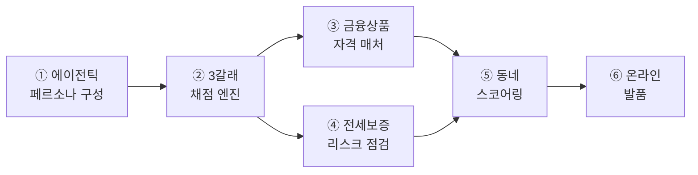

# 구현 아키텍처 상세 — 실제 코드·실제 값으로 따라가는 설계 문서

> 상위 개요(`아키텍처.md`)의 각 단계를 **실제 파일·함수·실행값**으로 세분화한다.
> 심사위원(비전공자)과 기술자 겸용 — 각 절은 ① 평문 → ② 실제 값 → ③ 코드 포인터/스키마.
> **원칙: 코드에 있는 것만 쓴다. LLM/결정론/사람 구분을 매 단계 명시. 임의값 0(모든 수치 출처 병기).**
> 예시는 전부 **한 사용자 P1**으로 관통한다. (검증 대조표는 `검증_손계산대조.md`)
> **실행값 기준 커밋: `0e85354`** (2026-08-01 재실행). 이후 데이터·규칙 변경 시 이 표기와 값을 함께 갱신할 것.

**P1 (이 문서의 주인공):** 1인 청년 · 전세 3.2억 · 만기 D-80 · 갱신권 미사용 · 아파트 · 생애최초 · 만35미만 · 소득 5천 · 자본 6천 · 자유입력 note=**"재택근무예요"**

> ⚠️ **정직성 기록(가중치 표기 통일)**: 이 문서엔 한때 W1(4축 원문 확정) **전** 값(통근 0.528→0.335)과 **후** 값(0.469→0.210)이 섞여 있었다. 현재는 전부 **W1 후 값**으로 통일했다(1인 세그먼트 base 46.9% → 재택 확정 21.0%). "40.5%"는 가구중립 기본 가중치(crosswalk)이고, 화면 눈금에 뜨는 건 1인 조정값 46.9%다.

---

## 0. 6대 기능 한눈에 (30초)

> KB만기.zip = **하나의 에이전틱 흐름**을 이루는 6개 기능. 이름표는 붙이되 설명·수치는 전부 실제 코드/실측값.



| # | 기능명 | 실체(코드) | 한 줄 |
|---|---|---|---|
| ① | **에이전틱 페르소나 구성** | `clarify`(LLM 축제약)+HITL+`spending_profiles` | 문진+자연어+확정으로 상황 흡수, 프로필 근거는 카드소비 통계 |
| ② | **3갈래 채점 엔진** | `compute_compare`+`rules/*.yaml` | 갱신·이사·매매를 법령 결정론으로 채점(프론트↔백엔드 오차 0 동치 + HF 공식 계산기 대조 오차 0.63원) |
| ③ | **금융상품 자격 매처** | `matcher` 자격필터+`kb_products` | 디딤돌·버팀목·KB 상품 자격을 소득·나이·무주택으로 판정(KB 3억 캡) |
| ④ | **전세보증 리스크 점검** | HUG 3중 요율+리스크/대비 행 | 반환보증을 '예측' 아닌 '제도+월비용 환산'으로 같은 저울에 |
| ⑤ | **동네 스코어링** | `scoring`(주거실태조사 가중치) | 예산 하드필터+통계 가중합, 왜 1위인지 근거 공개 |
| ⑥ | **온라인 발품** | `scenes`+facts(ODsay·상권·실거래)+`narrator` | 고른 동네의 하루를 실측으로 서사화, 지어낸 숫자 0 |

**기능별 3요소 (해결 순간 · 실제 예시 · 근거):**
- **① 페르소나** — (a) 사용자가 "재택이라 통근 덜 중요해요"처럼 표준 폼으로 안 잡히는 말을 할 때. (b) P1: "재택근무예요" → 통근 가중치 0.469→0.210(1인 세그먼트 46.9→21.0%, §A-2). (c) 프로필 traits는 경기 카드소비(2026-03) 세그먼트 도출 — 개인 실측(마이데이터)은 실서비스 해자로 정직 구분.
- **② 채점** — (a) 세 갈래 비용을 한 저울에 놓고 싶을 때. (b) P1 매매 6.28억·월 103만(§A-3 계보). (c) 법령/공시 YAML(checked_at) + HF 계산기 앵커 + engine↔tools 동치테스트. ML 예측 배제(재현·감사 위해).
- **③ 자격 매처** — (a) "이 조건에 무슨 상품이 되나" 물을 때. (b) P1 매매 → KB주담대+화재보험+청약(§A-4). (c) 자격은 결정론 필터, 사유만 LLM. 권유는 verify.py 차단.
- **④ 리스크 점검** — (a) "전세 이자 싸 보이는데 반환보증까지 넣으면?" (b) P2 이사 이자 71.9만 + 반환보증료 5.5만 = 실질 77.4만(§A-3 기능④ 화면). (c) ML 사고예측은 오탐 시 은행 책임 리스크로 **의도적 배제** — 대신 HUG 공시 요율로 비용을 확정 표시.
- **⑤ 스코어링** — (a) "이 예산에 어느 동네가 나에게 맞나". (b) P1 top3 성북·당인·신내(예산 이내), 근거 breakdown 공개(§A-5). (c) 가중치는 국토부 주거실태조사 이사사유 응답률 도출(감 아님).
- **⑥ 발품** — (a) "그 동네 살면 내 하루가 어떤가". (b) mapo 카페 237곳·여의도 17분·실거래 사례로 서사(§A-6). (c) 숫자는 facts에 있는 것만(verify 대조), 미수집 동네는 폴백(안 지어냄).

---

## A-1. 리소스 편 — 무엇이 어떤 스키마로 준비돼 있나

계산·개인화의 재료는 **미리** 적재돼 있고 런타임은 **읽기만** 한다(외부 API 런타임 호출 X → 발표장 오프라인 안전).

### ① 법령·규정 — `rules/*.yaml` (결정론 계산의 근거, 출처+checked_at 필수)
```yaml
# rules/lending_regulated.yaml (실물 일부)
# 출처: 금융위 '26 가계부채 관리방안(fsc.go.kr/.../87222) / obank.kbstar.com / HF 공시
# ✅ checked_at: 2026-07-20 (ref/rules_확정값_실데이터반영용.md — 셀 단위 대조 완료)
ltv:
  no_house:   {non_regulated: 0.70, regulated: 0.40}
  first_home: {non_regulated: 0.80, regulated: 0.70}
mortgage_cap:
  gov_metro: 600000000        # 정부 절대한도 (2025.6~)
  kb_purchase: 300000000      # ★KB 자체 정책 (2026.7.10~) — 은행만 아는 값
dsr:
  cap: 0.40
  stress_rate: {metro_regulated: 0.030}   # 수도권 규제 (10.15 대책)
```
- **존재 이유**: 이게 없으면 3갈래 계산(SC-03 비교표)의 모든 금액이 불가능. 각 값에 `source_url`·`checked_at` → "임의값 0"이 감사 가능.

### ② 소비 성향 — `agents/spending_profiles.yaml` (세그먼트 통계 근사)
```yaml
"1인":
  traits: ["패스트푸드·배달 음식 위주 식사", "취미·여가·구독 지출 활발", "짧은 통근 선호"]
  keywords: ["역세권", "소형 평면", "생활 편의 밀집"]
  workplace: {name: "판교(IT)", lat: 37.3948, lng: 127.1112}   # 대표 직장(가정)
```
- 이 값의 근거: 경기 카드소비(2026-03) 연령 세그먼트 집계 — 예) 20대 취미/오락 점유율이 세 그룹 중 최고 → `취미·여가 활발`. "카페"는 오히려 40대가 높아 **제거**(#39에서 반박·수정). → 임의 설정이 아니라 통계 도출.
- ⚠️ **"이 사람" 실측이 아니라 "이 연령 세그먼트" 근사.** 개인 실소비(마이데이터·KB카드)는 실서비스 해자(로드맵).
- **존재 이유**: 없으면 발품(SC-07) 서술·소비 매치 스코어가 세그먼트 개인화를 못 함.

### ③ 실거래 — `trades.db::trades` (64,431행 · 국토부 실거래 실데이터 스냅샷, O1)
```
스키마: id, sigungu_code, umd_name, trade_type(sale/jeonse/monthly), price, monthly, area_m2, deal_ym, house_type
실제 행: ('성산동', 670000000, 59.85㎡, '202606', 'sale', '아파트')
        ('아현동', 2220000000, 59.99㎡, '202606', 'sale', '아파트')
        ('창전동', 1300000000, 84.86㎡, '202606', 'sale', '아파트')
```
- 출처: 국토부 실거래 오픈API(아파트+연립다세대). **런타임은 이 DB만 읽음**(`tools/molit.fetch_trades`).
- **존재 이유**: 없으면 동네 후보(SC-04) 예산 필터·중위가·발품 실거래 사례가 전부 불가능.

### ④ 상권·통근 — `trades.db::region_facts`(323행·81개 동) / `region_transit`(326행·82개 동)
```
region_facts:  ('mapo','dining_cafe','["음식점·카페 237곳 밀집"]', 237, '소상공인시장진흥공단 상가정보 (2026-07)')
               ('mapo','grocery', '["반경 500m 내 마트·편의점 144곳"]', 144, …)
               ('eunpyeong','grocery','["…303곳"]', 303, …)
region_transit:('mapo','여의도(금융권)', 17분, 환승1, estimated=0)
               ('mapo','상암DMC', 22분, 환승0, estimated=0)
```
- 수집 스크립트: `scripts/refresh/refresh_regions.py`(소상공인 상권 API + ODsay). 오프라인 갱신 → DB. `estimated=0`=실측, `=1`=직선거리 폴백.
- **존재 이유**: 없으면 발품의 "카페 N곳"·"통근 N분"이 근거를 잃음(name+tags 폴백으로만).

### ⑤ KB 상품 — `data/kb_products/*.md` (RAG 소스, 프론트매터 구조화)
```markdown
---
product_id: buttimok_youth
name: 청년전용 버팀목 전세자금
branch: [갱신, 이사]
role: policy
condition: "만 19~34·소득 5천·보증금 3억·순자산 3.45억 이하"
max_amount: 150000000
source_url: "https://nhuf.molit.go.kr/..."
checked_at: 2026-07-20
---
```
- 8종(buttimok/didimdol/kb_mortgage/kb_jeonse/fire_insurance/return_guarantee/kb_chungyak/README).
- **존재 이유**: 없으면 금융 연결(SC-09)에서 자격·조건·근거를 붙일 수 없음.

### ⑥ 스코어 가중치 근거 — `tools/scoring.py::SURVEY_RATIOS`
```python
SURVEY_RATIOS = {"commute":0.306, "consumption":0.255, "budget":0.083, "preference":0.111}
# 출처: 2024 주거실태조사 통계보고서 <표 10> '이사 이유'(전국·복수응답). 4축 전부 원문(W1).
# commute 직주근접 30.6 / consumption 교통·편의·녹지 복합 25.5 / preference 가족근접8.1+교육3.0=11.1 / budget 집값부담 8.3
# ※ 25.5를 통근에 합산(56.1)한 오독 → consumption 재매핑(선반영), W1에서 예산·선호도 원문 승격. 정규화 0.405/0.338/0.147/0.110
```
- **존재 이유**: 동네 추천 가중치가 "감 0.35"가 아니라 **통계 도출**임을 증명하는 근거.

---

## A-2. 페르소나 편 — 기능① 에이전틱 페르소나 구성 (사용자 한 명이 프로필이 되기까지)

### 1) 문진 입력 → 스키마 (실물)
```python
ContractInfo(type="전세", deposit=320_000_000, monthlyRent=0, expiryDate="2026-10-15",
             renewalUsed="미사용", housingType="아파트", preferredArea="", note="재택근무예요")
FinanceInfo(annualIncome=50_000_000, ownCapital=60_000_000, household="1인",
            firstHome="예", under35=True)
```
포인터: `app/schemas.py::ContractInfo/FinanceInfo` (프론트 `types.ts`와 1:1).

### 2) 세그먼트 lookup (결정론) — `narrator.profile_for("1인")`
반환: `traits=[패스트푸드·배달…, 취미·여가·구독…, 짧은 통근…]`, `workplace=판교(IT)`.
> ⚠️ 세그먼트 통계 근사(개인 실측 아님). 정직 표기 유지.

### 3) note 해석 — `agents/clarify.py` (여기가 **LLM 판단 노드**)
**두 경로 (`settings.llm_active`로 분기):**

**(a) LLM off = 키워드 폴백** (재현가능, 테스트/오프라인). 실제 출력:
```
noteSignals: ["재택·동네생활 중시 → 통근을 거의 고려 안 함(strong_down, 배수 ×0.3)·생활편의↑"]   # _NOTE_MAP 규칙
conflicts  : []
```
**(b) LLM on = Claude 해석** (축 제약). 실측 예(다른 note "재택이라 카페 자주 가요"):
```
noteSignals: ["재택근무로 통근 중요도 낮음", "동네에서 대부분 해결 및 카페 이용 잦음"]   # 자연어 해석
```
검증 게이트: 출력 JSON의 `weight_adjustments`가 4축(commute/consumption/budget/preference) 밖이거나 배수 0.3~2.0 밖 → **즉시 키워드 폴백**(`_llm_interpret`). 창작 차단.

**(c) 모순 감지 (항상 결정론)** — note="아이 학군이 좋았으면" + household=1인:
```
conflicts: ["'자녀' 관련 언급이 있는데 가구 유형은 '1인'로 선택하셨어요. 맞는지 확인해 주세요."]
```
감지는 `_household_conflict`(사실 대조), **되묻는 문구만** LLM이 자연스럽게(감지 로직엔 LLM 미개입).

### 4) 가중치 조정의 타당성 ★ — 4단 논리
```
[1] 기본값 = 통계    : SURVEY_RATIOS(주거실태조사) → 정규화. "평균인의 기본값"
[2] 세그먼트 조정    : PERSONA_ADJUST["1인"] = {commute ×1.3} (청년의삶 통근 39.2% 1위)
[3] 본인 진술 우선    : note 보정 — "재택" → 통근을 거의 고려 안 함(strong_down, 배수 ×0.3), "카페" → consumption ×1.3
                       원칙: 통계는 기본값, **본인이 확정한 진술은 그 개인의 사실이라 통계보다 우선**
[4] HITL 확정        : 반영은 사용자가 [반영할게요] 눌러야. LLM/규칙은 제안만
매 단계 재정규화(합=1) 유지.
```
**조정 규칙 공개표** (코드 `_NOTE_MAP` 실제 값):
| note 키워드 | 축 | 배수 |
|---|---|---|
| 재택/집에서/동네에서 | commute / consumption | ×0.3 / ×1.3 |
| 자차/운전 | commute | ×0.7 |
| 도보/걸어서 | preference | ×1.2 |
| 카페/외식/배달 | consumption | ×1.3 |
| 조용/정주 | preference | ×1.2 |
| 통근/출퇴근/회사 | commute | ×1.3 |

**P1 실제 조정 (조정 전 → 후):**
```
before(가구 통계만): commute 0.469 · consumption 0.301 · budget 0.098 · preference 0.131
after ("재택근무예요" — 통근 카드 승인, strong_down ×0.3): commute 0.210 · consumption 0.449 · budget 0.146 · preference 0.195
→ 통근이 0.469→0.210으로 낮아지고 생활·소비가 0.301→0.449로 상승, 순위 1위가 통근→생활·소비로 역전.
   (W1로 base 생활·소비 비중이 커져 역전이 더 뚜렷해짐)
```
포인터: `clarify.note_weights` · `scoring.weights_for`/`derive_weights`/`PERSONA_ADJUST`.

**HITL 이벤트 실물** (`POST /api/hitl`): `{"choice":"applied","signals":["재택…"],"note":"재택근무예요"}` → Langfuse 세션에 `hitl_persona_confirm` 이벤트.

### 5) 최종 PersonaProfile (조합 산출물, 결정론) — `tools/persona.build_persona`
```json
{ "segment": "1인 청년 임차 가구",
  "headline": "1인 청년 임차 가구 · '통근'을 가장 중시",
  "workplace": "판교(IT)",
  "weights": {"commute":0.210,"consumption":0.449,"budget":0.146,"preference":0.195},
  "consumption": ["패스트푸드·배달…","취미·여가·구독…","짧은 통근…"],
  "resources": ["통근 실측 기준 직장: 판교(IT) (ODsay)","반경 상권 집계 (소상공인 상권 API)",
                "국토부 실거래 사례","연령 세그먼트 소비 성향 (카드소비 통계)"],
  "budgetBand": "약 6.3억 이내 후보에서 선별 (예산 초과 동네는 0단계 하드필터로 제외)" }
```
(budgetBand는 고른 갈래 예산을 프론트가 전달해 채워짐 — 매매 6.28억 기준.)

---

## A-3. 계산 편 — 기능② 3갈래 채점 엔진 + 기능④ 전세보증 리스크 점검 (결정론, LLM 0)

`tools/compute_compare`. 프론트 `engine/compare.ts`와 **오차 0 동치**(fixtures 테스트). P1 실제 출력:

| 갈래 | depositOrPrice | loan | oneTime | 월부담(monthlyBurden) | 보증료/월 |
|---|--:|--:|--:|--:|--:|
| 갱신 | 336,000,000 | 16,000,000 | 0 | **84,400** | 32,533 |
| 이사 | 542,000,000 | 222,000,000 | 1,760,000 | **774,753** | 55,103 |
| 매매 | 628,004,078 | 248,004,078 | 9,909,793 | **1,031,213** | 0 |

> **monthlyBurden은 보증료 포함**이다(이사 774,753 = 이자 719,650 + 보증료 55,103). 화면은 이걸 **분해**해 보여준다(이중계산 금지 — `검증_손계산대조.md` 참고, 프론트 수정 완료).

### 기능④ 전세보증 리스크 점검 — 대표 화면 (반환보증을 같은 저울에)
E2E §3-3("전세 이자 41만이 싸 보이지만, 반환보증까지 넣으면 실질 45만")과 **1:1**. `CompareTable.tsx`:
```
┌ 이사 ────────────────────────────┐
│ 실질 월 부담 (반환보증료 포함)      │
│   77만원                          │   ← monthlyBurden 774,753 (한 번만)
│ 이자·월세 71.9만 + 반환보증료 5.5만 │   ← 분해 표시(monthlyBurden − guaranteeMonthly / guaranteeMonthly)
└──────────────────────────────────┘
```
- 반환보증료는 `guarantee_hug.py`의 HUG 3중 요율(보증금·부채비율·주택유형 구간)로 월 환산. **사고 확률을 ML로 예측하지 않는다** — (근거) 오탐 시 은행 책임 리스크 → 의도적 배제, 대신 제도 요율로 비용을 **확정** 표시.
- 리스크/대비 행(`risks`/`cares`)에 "반환보증 점검 (+N/월)" 노출 → 전세사기 시대 소비자 보호 + 그룹 크로스셀.

**전세가율 지표 (실거래 나눗셈, 예측 아님)** — `tools/jeonse_ratio.py` + `rules/jeonse_ratio.yaml`:
```
전세가율 = 보증금(동 전세 중위) ÷ 같은 동 매매 중위가(최근 6개월 실거래)
구간(HUG 담보인정비율 90% 기반): ≤0.70 여유 / ≤0.90 반환보증 권장 / >0.90 가입 어려울 수 있음
표본 <5건 → 지표 미표시(안 지어냄). basis에 표본 수 명시.
```
- 실측 예(이사 후보): 응암동 전세중위 5.2억 ÷ 매매중위 7.95억 = **65% [여유]**(매매 536건) · 하월곡동 전세중위 5.25억 ÷ 매매중위 9.15억 = **57% [여유]**(252건). ※ 하월곡동 비율은 매매중위 상승(7.95→9.15억, 재수집)으로 56→57% 이동.
- 노출: 동네 후보 카드 뱃지(safe민트/caution옐로/alert레드, 판정·안내형 문구) + 발품 facts 한 줄 + verify 대조 대상. `Region.jeonseRatio`(schema↔types 1:1).
- ⚠️ 입력 한계: 폼에 현 주소 동·평형이 없어 **갱신 카드(현 주소 기준)·SC-03 이사 카드**는 동 특정 불가 → 동이 정해지는 **동네 후보(SC-04)·발품(SC-07)**에 얹음(로드맵: 주소·평형 입력 시 확장). `checked_at: null`(HUG 90% 사람 확인 대기).

### 매매 계보 (코드가 실제로 뱉은 중간값, 한 줄씩)
```
자본 = 자기자본 6천만 + 회수 보증금 3.2억 = 380,000,000        ← own_capital + deposit
LTV  = 0.70 (생애최초·규제지역)                               ← lending_regulated.yaml ltv.first_home.regulated
산정금리 = 0.0710 (= base 0.041 + 스트레스 0.030 …)           ← effective_dsr_rate(kb_base,stress,base_ratio,ltr)
DSR한도 = 248,004,078 (소득5천만×40% 원리금 PV, 30년)         ← dsr_loan_limit
디딤돌  = 자격O, 한도 240,000,000, 금리 2.85% (생애최초유형)   ← policy_loans.didimdol_eligibility (기금)
은행분 캡 = min(KB 3억, 정부 6억) = 300,000,000               ← mortgage_cap
max_price = min( 자본/(1−LTV)=1,266,666,667,  자본 + min(DSR 248M, 디딤돌240M+KB300M=540M) )
          = 380,000,000 + 248,004,078 = 628,004,078          ← solve_max_price  (★DSR이 바인딩)
```
포인터: `tools/lending_calc.py`(solve_max_price/dsr_loan_limit/effective_dsr_rate), `tools/policy_loans.py`.

### "현재 대비 차액"은? (정직)
- 백엔드는 갈래별 `monthlyBurden`(새 부담) + `savings`(일회성 절감)만 낸다. **"현재 월 주거비 대비 델타" 필드는 없다.** 사용자가 표에서 각 갈래 월부담을 비교하는 구조.
- 화면 표시: `CompareTable.tsx`가 `monthlyBurden`(월부담)을 카드로. **명시적 "vs 현재" 행은 미구현(로드맵)** — 현재 전세는 추가 이자 0이라 델타 기준이 애매(전월세 케이스별 정의 필요).

### basis 문자열
`["규제지역 LTV 70%","KB 한도 3억","스트레스 DSR 가산 3.0%","디딤돌 혼합"]` — **숫자는 계산, 근거 문구는 하드코딩(의도됨)**. 사람이 읽을 근거 라벨.

### 검증 장치
HF 공적 계산기 대조(3.2억·2.85%·30년 → 우리 1,323,384원 vs HF 1,323,383원 = **오차 0.63원**) + `engine ↔ tools` **오차 0 동치** 테스트(`gen_fixtures.mjs`) → 이 계산이 재현·감사됨.

---

## A-4. KB 상품 편 — 기능③ 금융상품 자격 매처 (어떤 정보로 붙는가)

- **자격 필터 = 결정론** (`agents/matcher.py`): 갈래 + 소득 + 나이 + 무주택 → 통과 상품. P1 매매 실제 매칭:
```
main : KB 주택담보대출 (조건: 생애최초 LTV 최대 80%·규제 무주택 40%, DSR 40% 이내)
guar : 화재보험      extra: 주택청약종합저축
```
- **LLM 사유(통역)**: `recommendReason` = "왜 조건에 맞는지" 문장만. (LLM off면 템플릿: "규제·소득 요건에 따라 한도가 정해지는 은행 주담대예요")
- **한도 델타("디딤돌 적용 시 X→Y")**: **미구현**(E2E §4 로드맵). `compare.py`가 엔진 동치라 별도 작업.
- **정보제공 가드 (verify.py)**: 권유 표현 차단. `SOLICITATION_PATTERNS = ["추천합니다","추천드립니다","하세요","가입하세요","무조건","확실"…]` → 감지 시 재생성/폴백. "가입하세요" ❌ / "조건에 해당될 수 있어요" ⭕.
- 상품 8종이 "3갈래 × 자격"을 커버. 확장은 **같은 프론트매터 스키마로 md 추가**만.

---

## A-5. 동네 스코어링 편 — 기능⑤ 동네 스코어링 (예산 통과 후보의 순위)

`tools/scoring.py`. **0단계 예산 하드필터**(예산 초과 동네 제외) → 통과 후보만 **가중합**으로 순위.
```
동네점수 = Σ 가중치[축] × 점수[축]
  가중치 = persona.weights (A-2, 결정론·note 반영)
  점수   = commute(통근분, region_transit) · budget(예산 여유) · consumption(상권 밀집×성향) · preference(선호구)
```
**P1 (매매 갈래 · 예산 6.28억 · 재택 확정 후 weights commute 0.210·consumption 0.449…)** 실제 top3:

| 동네 | 중위가 | score | breakdown(commute/budget/consumption/preference) |
|---|--:|--:|---|
| 공릉동 | 6.2억 | 0.615 | 0.20 / 0.77 / 0.76 / 0.6 |
| 갈현동 | 6.0억 | 0.595 | 0.00 / 0.92 / 0.76 / 0.6 |
| 도봉동 | 5.4억 | 0.592 | 0.00 / 0.96 / 0.74 / 0.6 |

> ※ 이 top3는 **매매 갈래**다. S1 데모의 "동선동1가→4가"는 **이사 갈래**(예산 5.02억)로 다른 실행이다 — 혼동 주의.

- "왜 추천?" 근거(`scoreReasons`)를 화면에 그대로 노출(블랙박스 아님).
- ⚠️ 정직: 상권·통근 데이터 미수집 동은 commute·consumption이 **중립 0.5**(근거 없는 값 안 지어냄). 수집된 동(mapo: 카페 237곳·여의도 17분)은 실측으로 채워짐 → 순위가 달라짐.
- 포인터: `scoring.rank`/`score_region`/`weights_for`. 가중치 출처 = A-1 ⑥ SURVEY_RATIOS.

---

## A-6. 발품 편 — 기능⑥ 온라인 발품 (소비패턴이 하루가 되기까지)

`agents/narrator.py`. 씬 구조는 `scenes.yaml`(콘텐츠-코드 분리), 숫자는 facts(전부 출처 표기).

- **씬 선택 규칙(공개)**: `scenes.regions[regionId][branch]` 있으면 지역 씬, 없으면 `base[branch]`. '-m' 접미사=월세 후보. P1 매매 base 씬 5개(07:20 출근→08:30 카페→13:00 여가→19:00 외식→22:30 귀가).
- **주입 facts (실물, 출처 포함)** — 수집된 동네(mapo)일 때:
```
상권(소상공인API): 음식점·카페 237곳 · 마트·편의점 144곳 · 여가 22곳
통근(ODsay)     : 판교 근무 시 대중교통 약 N분 (region_transit 캐시)
실거래(국토부)  : 전용 46㎡ 매매 5.5억 (202606)   ← trades.db sample_trade
```
  (미수집 동네는 상권/통근 없이 실거래+name/tags 폴백 — 근거 없는 값은 안 지어냄.)
- **narrator LLM on/off**:
  - off(폴백): "도봉구 창동로 옮기면 '대단지' 분위기 속에서 지금의 소비 습관(패스트푸드·배달…)을 이어가기 좋아요…"
  - on(통역): 위 facts를 엮어 하루 서사 — **숫자는 facts에 있는 것만**(verify 대조). 지어낸 금액/개수는 재생성.
- **verify가 막는 것**: facts에 없는 숫자 인용 → `numbers_grounded` 실패 → 재생성. 권유 표현 → `contains_solicitation` 차단.
- **"다른 사람이면?"**: P2(신혼·여의도)로 바꾸면 workplace=여의도 → 통근 씬·마트·공원 중심, 소비 traits=유아용품·나들이. **노드는 같고 컨텍스트 조합만 다름**(= 개인화의 실체).

---

## A-7. 관측 편 — 이 전부가 한 trace에

- `POST /api/analyze` = LangGraph 6노드, 부모 span **`journey`**. 프론트 `X-Session-Id` → `session_scope` → 한 여정 = 한 Langfuse **Session**(analyze·regions·simulate·products·hitl 후속 trace 그룹핑).
- 각 span 기록(무엇을 보고/판단해/넘겼는지):
  - clarify: `{note, 해석결과, conflict_detected, llm_used}`
  - compare: `{규칙 스냅샷(LTV·KB캡·전환율+checked_at), 3갈래 요약}`
  - persona: `{weights_before → weights_after, 소비성향 출처}`
  - regions: `{후보별 score breakdown, 예산필터, 가중치}`
  - narrate/llm: `{주입 facts, verify 결과(권유차단·숫자그라운딩·재생성·폴백)}`
  - hitl: `{제안 신호, 사용자 선택}`
- → **심사위원이 세션 하나로 전 과정을 감사**(어떤 값이 어떤 규정으로 계산됐고, LLM이 뭘 봤고, 사람이 뭘 확정했는지)할 수 있다. LLM 꺼도 구조 동일(관측 가능).

---

## A-8. 정직성 표 (#41 계승 — 과장 0)

| 단계 | 파일 | 성격 | 의도된 이유 |
|---|---|---|---|
| 자유입력 해석 | `clarify._llm_interpret` | **LLM**(축 제약)+키워드 폴백 | 무한 자연어는 규칙 불가 / 폴백은 오프라인 안전 |
| 모순 감지 | `clarify._household_conflict` | 결정론 | 사실 대조는 재현돼야 |
| 3갈래 계산 | `compare.compute_compare` | 결정론 | 금융 숫자는 감사 대상 |
| 규칙 라우팅 | `supervisor.route` | 결정론(if문, **자율 아님**) | 적용 선택만, 재현 |
| 페르소나 조합 | `persona.build_persona` | 결정론 | 조합 로직 재현 |
| 동네 순위 | `scoring.rank` | 결정론(통계 가중합) | 근거 설명가능 |
| 상품 자격 | `matcher` 필터 | 결정론 | 자격은 규칙 |
| 상품 사유·발품·브리핑 | `matcher/narrate` | **LLM 통역**+폴백 | 조합 폭발은 템플릿 불가 |
| 반영 확정 | 프론트 HITL | **사람** | LLM은 제안, 결정은 사용자 |

> "화려한 자율 에이전트는 만들기 쉽다. 감사 가능한 에이전트가 어렵고, 은행에 필요한 건 후자다."
