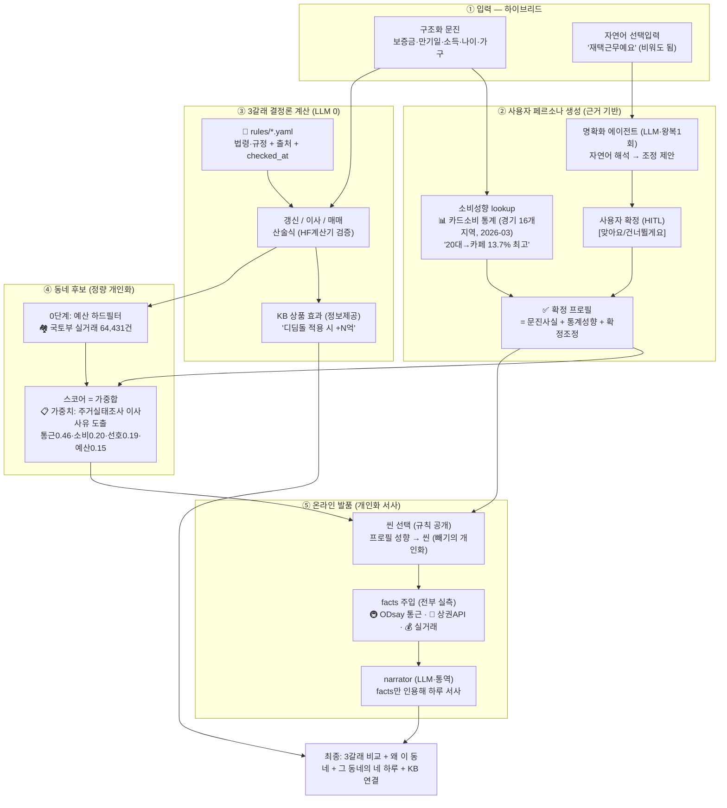
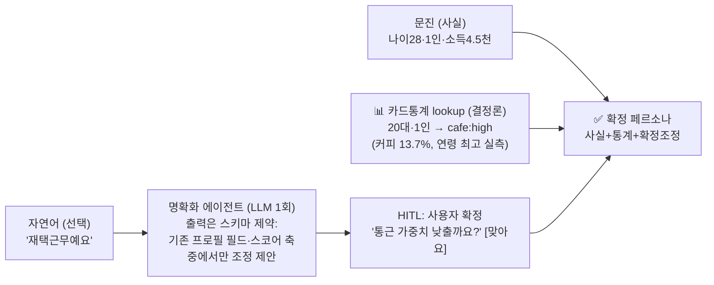
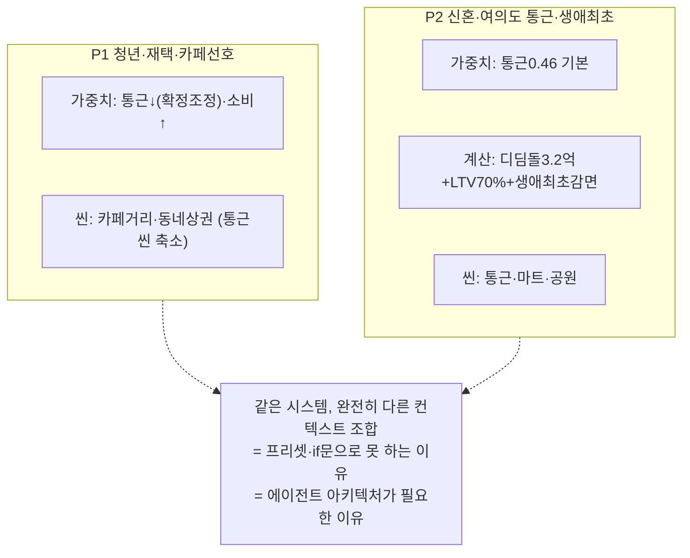
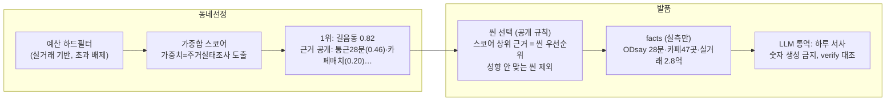

# KB 만기상담소 — E2E 아키텍처
### 처음 보는 사람을 위한 전체 흐름: 어떤 데이터가, 어디에, 왜 쓰이는가

> 이 문서 하나로 다음이 납득되어야 한다:
> ① 사용자만의 페르소나가 **어떻게(무슨 근거로)** 만들어지는가
> ② 그 페르소나로 컨텍스트가 **어떻게 조합**되는가 — 그리고 왜 여기가 "에이전틱"인가
> ③ 3갈래 숫자가 **어떤 산술식·출처**에서 나오는가
> ④ KB 상품이 어떤 **정보**로 붙는가
> ⑤ 소비패턴이 어떻게 **온라인 발품**으로 이어지는가
> **모든 단계에 임의값 0 — 통계·법령·실측만.**

---

## 0. 한눈에 보는 E2E



---

## 1. 데이터 리소스 — 무엇을, 어디서, 왜

| 데이터 | 출처 | 어디에 쓰이나 | 왜 이 데이터인가 |
|---|---|---|---|
| **카드소비 집계** (연령×업종, 2026-03) | 경기데이터드림 16개 지역 | ②페르소나 소비성향 | "20대는 카페 성향" 같은 프로필을 **임의 설정이 아니라 실측 도출** |
| **주거실태조사** (이사사유 응답률) | 국토부 2024 | ④스코어 **가중치** | "통근이 왜 0.46?"에 "이사사유 1·2위=직주근접30.6+교통25.5"로 답 |
| **실거래가** 64,431건 | 국토부 오픈API | ④예산필터·⑤발품 사례 | 합성 아닌 진짜 시세 — "지난달 이 평형 N억" |
| **상권 집계** (반경500m 업종수) | 소상공인시장진흥공단 | ④소비매치·⑤발품 씬 | "카페 47곳" — 성향↔동네 매칭의 실측 근거 |
| **통근시간** | ODsay 대중교통 실측 | ④스코어·⑤발품 | 가중치 1위 축(0.46)의 실측값 |
| **법령·규정** (LTV·DSR·전환율·요율) | 금융위·법령·HUG·HF 공시 | ③3갈래 계산 | 모든 금융 숫자의 출처 (checked_at 관리) |
| **KB 자체 정책** (주담대 3억 캡) | KB 2026.7.10 시행 | ③매매 계산 | **은행만 아는 값** — 외부 플랫폼이 못 베끼는 정확성 |
| KB 상품 5종 | KB·기금 공시 원문 | ③상품 효과·매칭 | 금리·한도 원문 그대로 (재작성 금지) |
| (실서비스) 개인 소비 | 마이데이터·KB카드 | ②프로필 실측화 | PoC는 합성+명시, 실서비스 해자 |

> **원칙: 모든 데이터에 출처·기준일. "어디서 났어요?"에 전부 답 가능.**

---

## 2. ② 페르소나 생성 — "임의로 만들지 않는다"



**세 겹의 근거:**
1. **사실**은 사용자가 직접 말한 것 (문진)
2. **성향**은 통계에서 결정론적으로 조회 (카드소비 실측 — "20대 cafe:high는 커피/음료가 연령 최고 13.7%라서")
3. **조정**은 LLM이 제안하되 **사용자가 확정** (HITL) — LLM은 창작 불가(스키마 제약), 반영 권한 없음

→ "페르소나를 임의로 만든다"가 아니라 **"사실 + 실측 통계 + 본인 확정"의 합성.** 어느 필드를 물어도 근거가 나온다.

---

## 3. 어디가 "에이전틱"인가 — 핵심 답변 ★

> Q: "결국 페르소나와 개인화 산출물은 그때그때 컨텍스트 조합인데, 여기가 에이전틱이어야 하는 것 아닌가?"
> **A: 맞다. 그리고 정확히 그렇게 설계했다. 단, "자율"이 아니라 "동적 조합"으로.**

**에이전틱함의 실체 = 사용자마다 다른 컨텍스트의 동적 조합:**


**단, 조합의 각 단계는 역할이 나뉜다:**
| 단계 | 담당 | 왜 |
|---|---|---|
| 무엇을 조합할지 (선택 규칙) | **결정론** (공개 규칙: scene_rules·스코어) | 재현·감사 가능해야 — 금융 |
| 모호한 입력의 해석 | **LLM (판단)** — 명확화·상품사유 | 무한한 자연어는 규칙 불가 |
| 조합 결과를 사람 말로 | **LLM (통역)** — 브리핑·발품·문자 | 조합 폭발은 템플릿 불가 |
| 반영 승인 | **사용자 (HITL)** | 최종 결정은 사람 |

→ **"선형 파이프라인 + 규칙 라우팅 + LLM 노드 5개(판단2·통역3)"가 우리 아키텍처다.**
ReAct·자율계획이 아닌 이유: 금융은 같은 입력→같은 출력(재현), 왜 그 답인지(감사)가 생명. **KB 하네스 철학과 동일한 판단.**

**MCP: 안 쓴다 (PoC).** 도구가 전부 내부 함수라 표준 프로토콜의 이점이 없고 통합 리스크만 추가. 단 도구를 독립 함수로 분리해둬 실서비스에서 KB 내부 시스템(여신심사·상품DB)과 MCP로 연결 가능 — 로드맵 한 줄.

---

## 4. ③ 3갈래 계산 — 산술식과 출처

모든 숫자의 계보 (예: P2 신혼·매매):
```
자본 = 자기자본 6천 + 회수보증금 3.2억 = 3.8억
디딤돌 자격: 신혼 소득8천 ≤ 8.5천 ✓ → 한도 3.2억, 금리 2.85%   ← policy_loans.yaml (기금 공시)
LTV: 생애최초·규제지역 = 70%                                    ← 금융위 '26 가계부채방안
DSR 한도: 소득×40% ÷ 12 → pv_annuity(…, 4.1%+스트레스3.0%, 30년) ← 산정용 금리 분리
은행분 캡: min(KB 3억, 정부 6억) = 3억                           ← KB 2026.7.10 (은행만 아는 값)
max_price = min(자본/(1-LTV), 자본 + min(DSR한도, 디딤돌+3억))
월 상환 = annuity(디딤돌분,2.85%) + annuity(은행분,4.10%)        ← 표시용은 base 금리
취득세 = 구간세율 − 생애최초 200만 감면                          ← 지방세법·지특법(2028까지)
검증: HF 공식 계산기와 월 1,323,383원 일치 (오차 0.6원) + 프론트·백 동치 테스트
```

**KB 상품 효과 = 정보 제공 (권유 아님):**
- "디딤돌이 **적용되면** 한도가 6.3억→7.7억으로 달라져요" ⭕ (계산 결과 병렬 제시)
- "가입하세요" ❌ (verify.py가 권유 표현 차단) — 금소법 대응 설계
- 우대금리 정보: "급여이체 시 최대 -0.9%p **해당될 수 있어요**" (확정 아님 명시)

---

## 5. ④→⑤ 동네와 발품 — 개인화가 근거로 이어지는 흐름



- **추천 근거가 곧 발품 소재**: "통근·카페매치로 1위" → 발품도 통근 씬·카페 씬 중심. 흐름이 안 끊김
- **빼기의 개인화**: 1인 청년에 학군 씬 없음, 무차량에 주차 씬 없음 — "그 사람 하루에 실제 등장할 것만"
- "비슷한 사람" 정보는 **통계 사실만** ("20대는 통근 39.2% 중시" — 출처有) / 선택 로그 넛지 금지

---

## 6. 왜 이 문제를, 왜 이렇게 푸는가 — 3문답 요약

**Q1. 왜 AI인가?**
숫자 계산엔 AI가 필요 없다(그래서 안 쓴다). AI가 필요한 건 ①무한한 자연어·상황의 해석(명확화) ②사용자마다 다른 조합을 사람 말로 풀어내기(통역). 이 둘은 규칙·템플릿으로 불가능하다.

**Q2. 왜 에이전트(아키텍처)인가?**
사용자마다 페르소나·계산경로·씬 구성이 전부 다르다 = **동적 컨텍스트 조합**. single-prompt는 환각·추적불가·회귀 문제. 노드 분리 + 결정론 라우팅 + LLM 판단/통역 분담이 답. 단 자율(ReAct)은 재현·감사 불가라 배제 — **KB 하네스와 같은 판단.**

**Q3. 왜 은행(KB)인가?**
3갈래 비교의 공통 변수가 전부 대출이고, KB 자체 여신정책(3억 캡)은 은행만 안다. 개인 소비(마이데이터)도 은행의 해자. **비교의 완성은 은행만 가능.**

---

## 7. 한 줄 요약

> **통계로 만든 페르소나(임의값 0) × 법령으로 계산한 3갈래(출처 100%) × 실측으로 채운 발품(지어낸 것 0)**
> **— 조합은 동적으로, 규칙은 투명하게, 판단은 통제되게, 확정은 사람이.**
> 이것이 KB 하네스 철학으로 만든, 만기 순간의 주거 결정 에이전트다.
