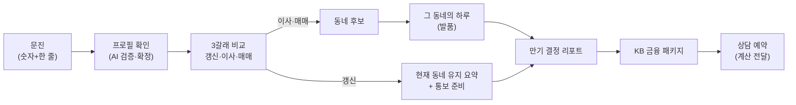

# 서비스 흐름 — 사용자가 무엇을 경험하나

> "그래서 고객이 뭘 받나"에 답한다. 기술 배경 없이 읽을 수 있게. 관련: [아키텍처](아키텍처.md) · [개인화_설계](개인화_설계.md)

---

## 1. 한 사람의 여정

**갱신 분기는 따로 완결된다** — 이사·매매만 동네 후보로 가고, 갱신은 "현재 동네 유지 + 통보 준비"로 리포트까지 바로 이어진다.

---

## 2. 화면별 — 사용자가 보는 것 / 뒤에서 일어나는 일

| 화면 | 사용자가 보는 것 | 뒤에서 | 핵심 근거 표기 |
|---|---|---|---|
| 문진 | 숫자 몇 개 + 자유입력 한 줄 | 입력 정규화 | — |
| 프로필 확인 | "이렇게 이해했어요" + 되묻기 | AI 해석·모순 검증(HITL) | 출처 배지(진술/실측/세그먼트) |
| 3갈래 비교 | 갱신·이사·매매 월 부담 | 법령·공시 결정론 계산 | LTV·DSR·전환율 근거칩 |
| 동네 후보 | 상위 3 동네 + "왜 추천?" | 예산 필터→개인 가중 순위 | 통근 N분·카페 N곳·가중치 |
| 그 동네의 하루 | 출근~귀가 서사 | 실측 facts 기반 LLM 서사 | 숫자는 facts에 있는 것만 |
| 결정 리포트 | 상황·채점·동네·여력 한 장 | 위 산출물 조합 | 근거 전부 인라인 |
| 금융 패키지 | 필요 여신·자격 상품·보증 | 자격 결정론 필터 | "당신 자격 기준(동네 무관)" |
| 상담 예약 | 날짜 선택 | 계산 결과 저장 | "정보 제공, 권유 아님" |

---

## 3. 산출물 3종

- **3갈래 비교표** — 갱신(인상분·묵시적 갱신 여부)·이사(전세대출·반환보증 포함 실질 월 부담)·매매(주담대·정책상품·취득세). 통보기한 경과 시 "동일 조건 묵시적 갱신이 원칙" 안내.
- **동네 후보 카드** — 중위 시세·예산 여유·통근·상권·전세가율(표본≥5), "왜 이 순위인지" 근거 공개, 실매물은 KB부동산 링크.
- **만기 결정 리포트** — ① 상황 ② 세 갈래 채점(칩 눌러 갈래 전환) ③ 왜 이 동네 ④ 그 동네의 하루 ⑤ 지출 여력 판정 ⑥ 다음 액션·KB 연결.

---

## 4. KB 연결 지점

- **갈래 → 여신 매핑**: 갱신=증액 전세대출 / 이사=신규 전세대출 / 매매=주택담보대출.
- **자격 상품 차액**: 버팀목·디딤돌 자격 시 일반 대비 차액 병치(예: 연소득 3,500만·대출 1.44억 기준 버팀목 적용 시 연 약 200만 절감 / S1 프리셋(P1 성북 이사) 리포트 화면값은 연 약 309만). **자격 없으면 표시 안 함.**
- **보호 장치**: 전세보증금 반환보증(보증료·전세가율 병치).
- **연결**: 상품명 → 공식 페이지 외부 링크, 동네 → KB부동산, 상담 예약 시 **계산이 창구에 전달**.
- 모든 산출물 하단 고지: **"정보 제공이며 권유가 아니에요. 실제 조건은 KB 심사에 따라요."**

---

## 5. 시나리오 3종 — 같은 통보, 다른 사람, 다른 답

세 사람 모두 **같은 "5% 올릴게요"**에서 출발한다. 답이 갈리면 그 차이는 페르소나 때문이다.

- **S1 · 재택 1인 · 이사** — "재택근무예요" 한 줄을 확정하면 통근 비중이 47%→27%(1인 세그먼트 46.9→27.4)로 내려가고 동네 순위가 실제로 바뀐다(동선동1가→동선동4가). *비대칭 "선택지"를 해소.*
- **S2 · 자녀 가구 · 갱신** — 통보기한이 지난 상태. "아이 학교가 중요해요"로 선호지역을 올리되, 갱신 카드가 "동일 조건 묵시적 갱신이 원칙"임을 알려줘 **몰라서 5% 올려주는 일**을 막는다. *비대칭 "기준"을 해소.*
- **S3 · 신혼 · 매매** — "이참에 사는 것도" → 디딤돌·LTV·DSR·KB 캡까지 반영해 최대 7.77억. 단 월 부담이 여력을 넘으면 **"넘어요(초과 16만)"**라고 정직하게 말한다. *비대칭 "감당 가능성"을 해소.*

> 시나리오의 코드 재현 검증은 작업 문서 `데모시나리오_코드검증_결과.md`(로컬) 참조.
