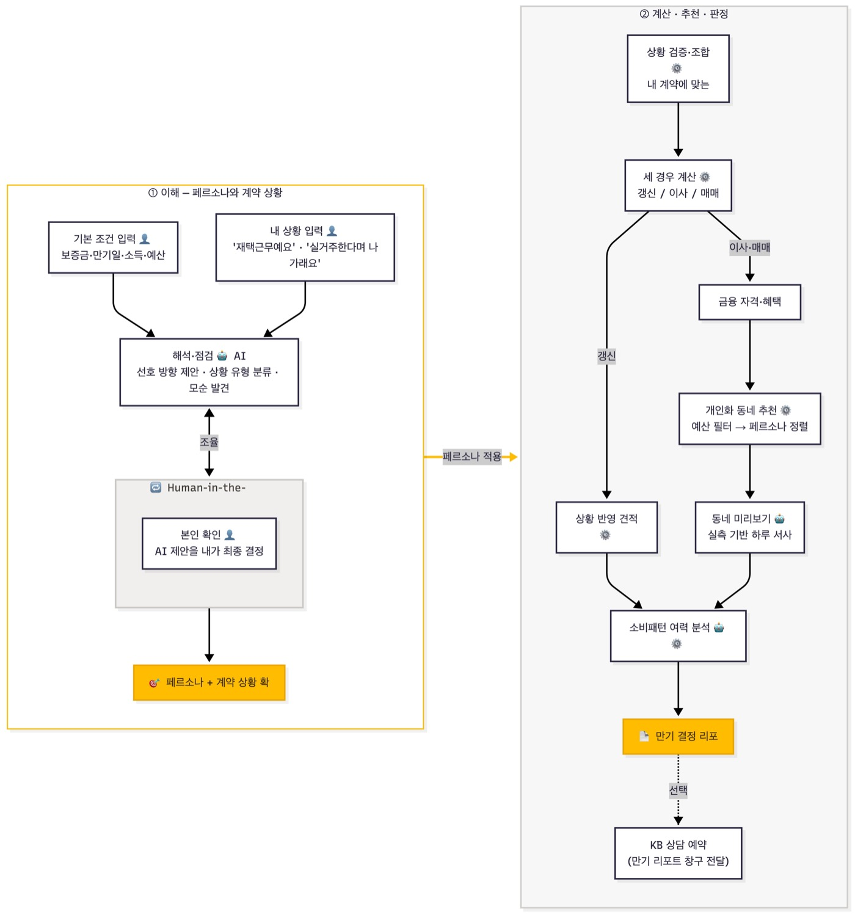
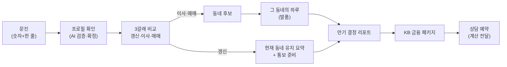

# 서비스 흐름 — 사용자가 무엇을 경험하나

> "그래서 고객이 뭘 받나"에 답합니다. 기술 배경 없이 읽을 수 있게 씁니다. 관련: [아키텍처](아키텍처.md) · [개인화_설계](개인화_설계.md)

---

## 1. 한 사람의 여정

**갱신 분기는 따로 완결됩니다** — 이사·매매만 동네 후보로 가고, 갱신은 "현재 동네 유지 + 통보 준비"로 리포트까지 바로 이어집니다.

---

## 2. 화면별 — 사용자가 보는 것 / 뒤에서 일어나는 일

| 화면 | 사용자가 보는 것 | 뒤에서 | 핵심 근거 표기 |
|---|---|---|---|
| 문진 | 숫자 몇 개 + 자유입력 한 줄 | 입력 정규화 | — |
| 프로필 확인 | "이렇게 이해했어요" + 되묻기 | AI 해석·모순 검증(HITL) | 출처 배지(진술/실측/세그먼트) |
| 3갈래 비교 | 갱신·이사·매매 월 부담 | 법령·공시 결정론 계산 | LTV·DSR·전환율 근거칩 |
| 동네 후보 | 상위 3 동네 + "왜 추천?" | 예산 필터→개인 가중 순위 | 통근 N분·카페 N곳·가중치 |
| 그 동네의 하루 | 출근~귀가 서사 | 실측 facts 기반 LLM 서사 | 숫자는 facts에 있는 것만 |
| 결정 리포트 | 상황·채점·동네·여력 한 장 | 위 산출물 조합 | 근거 전부 인라인 |
| 금융 패키지 | 필요 여신·자격 상품·보증 | 자격 결정론 필터 | "당신 자격 기준(동네 무관)" |
| 상담 예약 | 날짜 선택 | 계산 결과 저장 | "정보 제공, 권유 아님" |

---

## 3. 고객에게 남는 것 — 산출물

| # | 산출물 | 담긴 것 | 어디에 쓰이나 |
|---|---|---|---|
| 1 | **개인화 프로필** | 확정된 선호(출처 표시: 본인 말/실측 소비/또래 평균)와 계약 상황 | 이번 계산 전체의 기준 — 확인 전 신호는 어떤 계산에도 안 실림(HITL) |
| 2 | **세 갈래 비교 카드** | 아래 2-1~2-3 | 결정의 본체 — "같은 저울에 올린 세 개의 견적" |
| 2-1 | └ 갱신 카드 | 상황 반영 견적(0%/5%/전환율), 적용 법령 조항, 리스크·대비, 산식 공개 | 몰라서 올려주는 일 방지, 통보 준비로 이어짐 |
| 2-2 | └ 이사 카드 | 새 전세 최대 예산, 실질 월 부담(반환보증료 포함), 일회성 비용 | 동네 후보의 예산 상한으로 연결 |
| 2-3 | └ 매매 카드 | 최대 매매가, 필요 대출, 정책상품 자격 시 차액, 취득세 | 지출 여력 판정으로 연결 |
| 3 | **동네 후보 카드**(이사·매매) | 상위 **3개 동네**(예산 하드필터 후 개인 가중 순위) + 중위 시세·예산 여유·통근·상권·전세가율(표본≥5) + "왜 이 순위인지" 근거 | 실매물은 KB부동산 링크로 — 발품 갈 곳을 좁혀줌(고르진 않음) |
| 4 | **그 동네의 하루**(하루시뮬) | 선택한 동네에서의 출근~귀가 서사, 고정 3씬으로 조립. 숫자는 실측 facts에 있는 것만 | 순위표를 "이 동네에서 사는 감각"으로 번역 — 결정에 이입 |
| 5 | **KB 금융 패키지** | 갈래별 주요 대출 + AI 추천 사유 + 최대 한도·예상 월 상환, 보장(반환보증 등)·추가 상품 | "당신 자격 기준"(동네와 무관), 상품명 클릭 시 공식 페이지로 |
| 6 | **만기 결정 리포트** | ① 상황 ② 세 갈래 채점(칩 눌러 갈래 전환) ③ 왜 이 동네 ④ 그 동네의 하루 ⑤ 지출 여력 판정 ⑥ 다음 액션·KB 연결 | **최종 산출물.** 상담 예약 시 계산 그대로 창구에 전달 |

---

## 4. KB 연결 지점

- **갈래 → 여신 매핑**: 갱신=증액 전세대출 / 이사=신규 전세대출 / 매매=주택담보대출.
- **자격 상품 차액**: 버팀목·디딤돌 자격 시 일반 대비 차액을 병치합니다(예: 연소득 3,500만·대출 1.44억 기준 버팀목 적용 시 연 약 200만 절감 / S1 프리셋(P1 마포 이사) 리포트 화면값은 연 약 309만). **자격이 없으면 표시하지 않습니다.**
- **보호 장치**: 전세보증금 반환보증(보증료·전세가율 병치).
- **연결**: 상품명 → 공식 페이지 외부 링크, 동네 → KB부동산, 상담 예약 시 **계산이 창구에 전달**.
- 모든 산출물 하단 고지: **"정보 제공이며 권유가 아니에요. 실제 조건은 KB 심사에 따라요."**

---

## 5. 시나리오 3종 — 같은 통보, 다른 사람, 다른 답

세 사람 모두 **같은 "5% 올릴게요"**에서 출발합니다. 답이 갈리면 그 차이는 페르소나 때문입니다.

- **S1 · 재택 1인 · 이사** — "재택근무예요" 한 줄을 확정하면 통근 비중이 약 46%→17%로 내려가고, 마포동에 근소하게 밀려 있던 노고산동(음식점·카페 309곳)이 1위로 올라옵니다. *비대칭 "선택지"를 해소합니다.*
- **S2 · 자녀 가구 · 갱신** — 통보기한이 지난 상태입니다. "아이 학교가 중요해요"로 선호지역을 올리되, 갱신 카드가 "동일 조건 묵시적 갱신이 원칙"임을 알려줘 **몰라서 5% 올려주는 일**을 막습니다. *비대칭 "기준"을 해소합니다.*
- **S3 · 신혼 · 매매** — "이참에 사는 것도" → 디딤돌·LTV·DSR·KB 캡까지 반영해 최대 7.77억입니다. 단 월 부담이 여력을 넘으면 **"넘어요(초과 16만)"**라고 정직하게 말합니다. *비대칭 "감당 가능성"을 해소합니다.*

> 시나리오의 코드 재현 검증은 작업 문서 `데모시나리오_코드검증_결과.md`(로컬)를 참고하세요.
