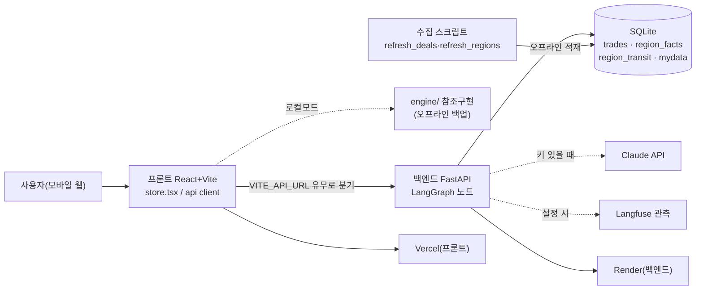

# 아키텍처 — 시스템이 어떻게 생겼나

> KB 만기상담소가 **실제로 돌아가는 물건**임을 3분 안에 판단할 수 있게 정리한다.
> 모든 수치는 현재 main 실행값. **실행값 기준 커밋: `be4ce16`**(2026-07-31). 관련: [에이전트_설계](에이전트_설계.md) · [개인화_설계](개인화_설계.md) · [서비스_흐름](서비스_흐름.md)

---

## 1. 전체 구성도

- **프론트↔백엔드 seam**: `api/client.ts`의 `localOrRemote()`가 `VITE_API_URL` 유무로 분기. 미설정이면 `engine/`·`data/`를 직접 호출(오프라인 데모), 설정이면 `${VITE_API_URL}/api/...` fetch. **환경변수 하나로 무수정 전환.**
- **런타임은 DB만 읽는다.** 외부 실거래·통근·상권 API는 **수집 스크립트가 오프라인에 적재**(발표장 오프라인 안전). LLM·Langfuse는 선택(키 없으면 폴백).

---

## 2. 요청 1회의 처리 흐름 (`/api/analyze` = LangGraph 6노드)

**🟦 결정론(순수 함수)**: `intake` · `compare` · `route` · `persona` — 대출 한도·월 부담·동네 점수·조합 로직. 감사 대상이라 LLM이 숫자를 만들지 않는다.
**🟨 LLM(+폴백)**: `clarify`(자유입력→축 배수) · `narrate`(하루 서사). 키 없으면 키워드/템플릿으로 대체.

> 화면은 이 그래프 외에 화면별 세부 엔드포인트도 쓴다: `/compare`·`/regions`(결정론) · `/validate-profile`·`/products`·`/report`·`/briefing`(LLM+폴백). 노드별 판단 주체는 [에이전트_설계](에이전트_설계.md) 표 참조.

---

## 3. 데이터 계층 (무엇이 실측이고 무엇이 합성인가)

| 테이블/데이터 | 규모(현재 main) | 출처·수집 | 실측/합성 |
|---|---|---|---|
| `trades` (실거래) | **64,431행** | 국토부 실거래 공개 API, `refresh_deals.py` 수집 스냅샷(서울 6구×최근 6개월) | ✅ 실측 |
| `region_transit` (통근) | **82개 동 · 326행** | ODsay 대중교통 경로, `refresh_regions.py`. 4개 대표 직장(판교·여의도·상암·시청) | ✅ 실측(`estimated=0`) |
| `region_facts` (상권) | **81개 동** | 소상공인시장진흥공단 상가정보(음식점·카페·마트·여가 수) | ✅ 실측 |
| `mydata` (소비) | 거래 278건 · 3 페르소나(P1/P2/P3) | 합성 시연 데이터 | ⚠️ 합성(실서비스는 마이데이터 동의 후 실 내역) |
| `rules/*.yaml` (법령·공시) | LTV·DSR·전환율·HUG요율·정책상품 | 금융위·주택도시기금·HUG·한국은행·KB 공시, 각 항목 `checked_at` | ✅ 공시 근거 |

**통근·상권·실거래는 진짜 데이터**다. 합성인 것은 소비 기록(마이데이터)뿐이며, 이는 **연동 지점(seam)만 바꾸면 되는** 구조라 로직은 완성돼 있다.

---

## 4. 신뢰·안정성 장치

- **폴백 3중** — ① LLM 키 없음/비활성 → 규칙·템플릿(오프라인 완주). ② 동적 T2SQL 실패/가드 위반 → 표준 집계(`standard_aggregates`). ③ **DB 가드**: 실DB(`trades.db`)에 통근 데이터가 비면 완전한 데모 DB로 폴백 + 기동 로그(조용한 실패 방지, `test_db_guard.py`).
- **숫자 verify**: 발품 서사의 모든 숫자는 facts에 등장한 값의 부분집합이어야 통과. 아니면 **재생성 2회 → 폴백**(`core/llm.py` `allowed_numbers`).
- **관측**: 설정 시 Langfuse span 트리(`journey` 부모 + intake/clarify/compare/route/persona/narrate/spend_query/validate). "왜 이 결과인가"를 사후 재구성.
- **검증**: `pytest` **161건** 통과. 3갈래 계산은 **프론트 `engine/compare.ts` ↔ 백엔드 `tools/compare.py` 오차 0 동치**(`test_compare_equivalence`) + 주택금융공사 공식 계산기 대조 오차 0.6원(3.2억·2.85%·30년).

---

## 5. PoC 범위와 한계 (실서비스 전환 지점 = seam)

- **범위**: 서울 6구 · 동 82개 · 대표 직장 4곳. 마이데이터는 합성 3 페르소나.
- **seam(교체만 하면 되는 지점)**: 소비 기록(합성→마이데이터 API) · 통근 대표직장(가정→사용자 입력) · 실거래(스냅샷→실시간 API, `core/cache.py`로 쿼터 보호) · DB(SQLite→Postgres, `DATABASE_URL`).
- **한계**: 통근·상권은 현재 **동 단위 실측이 있는 동만** 개인화가 강하게 작동(없는 동은 중립 처리·"구 기준" 정직 표기). 소비→개인 중요도 추정 층은 **명시된 가설**([개인화_설계](개인화_설계.md) §6).
