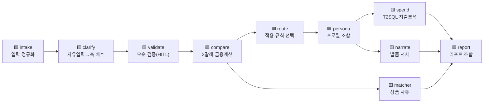

# 에이전트 설계 — AI를 어디에, 왜 썼나

> "AI를 진짜 쓴 건가, 왜 이렇게 썼나"에 답한다. 핵심 원칙: **이해·설명은 AI가, 계산은 규칙이, 결정은 사람이.**
> 모든 수치는 현재 main 실행값. 관련: [아키텍처](아키텍처.md) · [개인화_설계](개인화_설계.md)

---

## 1. 노드 구성 (LLM ↔ 결정론 구분)

🟦 결정론(순수 함수) · 🟨 LLM(+폴백). **돈·순위·자격 판정은 전부 🟦.** LLM은 이해(해석)·설명(서사·사유)에만.

---

## 2. 노드별 역할

| 노드 | 판단 주체 | 입력 | 출력 | 실패 시 폴백 | 코드 |
|---|---|---|---|---|---|
| intake | 🟦 규칙 | 문진 원본 | 정규화 상태 | — | `graph.py:intake_node` |
| **clarify** | 🟨 LLM | 자유입력 note | 4축 배수 + 신호 라벨 | 키워드 규칙표(`_NOTE_MAP`) | `agents/clarify.py` |
| **validate** | 🟨 LLM | 최종 프로필·신호들 | 모순 항목(되묻기) | 규칙 기반 간이 검증 | `clarify.py:validate_profile` |
| compare | 🟦 규칙 | 계약·재무 | 3갈래 월부담·초기비용 | — | `tools/compare.py` |
| route | 🟦 규칙(if) | 계약·재무·compare | 적용 규칙 라우팅 | — | `agents/supervisor.py:route` |
| persona | 🟦 규칙 | 세그먼트+실측+진술 | PersonaProfile·weights | — | `tools/persona.py:build_persona` |
| **spend** | 🟨 LLM | 페르소나·거래DB | 월평균·고정·변동여력 | 표준집계(`standard_aggregates`) | `agents/spend_query.py` |
| **narrate** | 🟨 LLM | 동네 facts·소비성향 | 하루 서사 | 템플릿(`templates.py`) | `agents/narrator.py` |
| **matcher** | 🟨 LLM | 갈래·상품문서 | 추천 사유 문장 | 문서 원문 사유 | `agents/matcher.py` |
| report | 🟦 규칙 | 위 산출물 조합 | 결정 리포트 | — | `agents/report.py:build_report` |

---

## 3. 왜 LLM인가 — 그리고 왜 여기'만'인가

각 LLM 지점은 **규칙으로는 못 푸는 이유**가 하나씩 있다:

- **clarify(자유입력 해석)** — 사람 상황은 무한 조합(반려동물·학군·재택·"마당 있는 집"…). 키워드표는 "반려동물"은 잡아도 "마당 있는 집"은 놓친다 → 의미 이해가 필요.
- **validate(모순 검증)** — "재택인데 통근이 중요", "1인인데 아이 학교" 같은 **키워드가 못 잡는 의미 충돌**을 전체 맥락으로 감지.
- **spend(분석 질문 생성)** — 페르소나마다 **물어야 할 질문 자체가 다르다**(신혼=이사·전세 관련 / 1인 재택=관리비·구독).
- **narrate(하루 서사)** — **사람마다 다른 하루**는 템플릿 조합 폭발. 단 숫자는 facts에 있는 것만.

그 외 전부(대출 계산·동네 순위·상품 자격·라우팅)는 **규칙**이다 — 틀리면 안 되고, 감사돼야 하니까.

---

## 4. 왜 '자율 에이전트'가 아닌가

ReAct·자율 계획(에이전트가 스스로 도구를 고르고 다단계 추론)을 **의도적으로 배제**했다. 이유: **재현·감사 불가**하고, 대출·자격처럼 틀리면 책임이 따르는 금융 판단에 부적합. 대신 **통제 3종**:

1. **순수 함수 계산** — 금융·순위 숫자는 결정론 함수(재현·검산 가능).
2. **HITL 확정** — LLM은 제안만. 사용자가 확인해야 반영. 확인 전 신호는 `noteAdjust={}`로 **어떤 계산에도 안 실림.**
3. **전 과정 trace** — 무엇을 보고 판단해 넘겼는지 span으로 기록.

> "화려한 자율 에이전트는 만들기 쉽다. 감사 가능한 에이전트가 어렵고, 은행에 필요한 건 후자다."

---

## 5. LLM 출력 제약 (창작 차단)

- **clarify**: 출력은 **4축(commute/consumption/budget/preference) 배수만**. 범위 **0.3~2.0** 밖이거나 축 밖이면 → **즉시 키워드 폴백**.
- **narrate/matcher**: 생성문의 숫자는 **facts/문서에 있는 값의 부분집합**이어야 통과(`allowed_numbers`). 아니면 재생성 2회 → 폴백.
- **spend(T2SQL)**: 가드레일 7종(SELECT만·테이블/컬럼 화이트리스트·`persona_id` 슬롯 강제·행 상한·음수 차단·실패 폴백·trace). sqlite authorizer로 강제.

---

## 6. 실행 증거 — 판단(LLM)과 계산(결정론)의 시간 대비

동일 입력(P1) 실측:

| 노드 | 성격 | 1회 소요 |
|---|---|---|
| compare | 🟦 결정론 | **≈ 0.20 ms** |
| 동네 scoring | 🟦 결정론 | **≈ 5.42 ms** |
| clarify / narrate | 🟨 LLM | 네트워크 왕복 **수 초**(키 활성 시, 환경 의존) |

→ **계산은 밀리초, LLM은 초 단위**. 이 대비가 "돈 계산은 규칙, 이해는 AI"라는 분업을 시간으로 증명한다. (LLM 비활성 기본값에선 전 구간이 결정론·밀리초로 완주 — 오프라인 데모 가능.)
