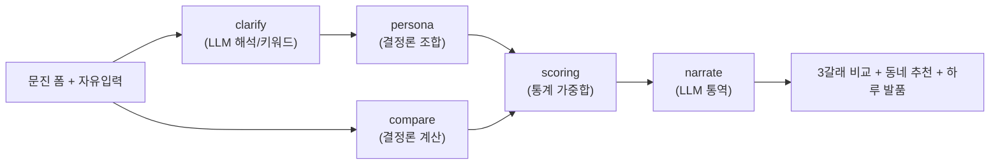

# 팀원 온보딩 — 한 사용자가 들어와 나가기까지 (실제 값 예시)

> "데이터가 어디에 어떤 스키마로 있고 → 그게 어떻게 리소스가 되고 → 페르소나로 조합되고 →
> 각 갈래가 어떻게 계산되고 → 동네가 어떻게 추천되는가"를 **딱 한 명의 사례**로 끝까지 따라간다.
> 모든 숫자는 실제 코드 출력(2026-07 기준). 처음 보는 사람이 이 문서 하나로 흐름을 잡는 게 목표.

---

## 0. 30초 요약



**규칙 하나만 기억**: 숫자는 전부 **결정론 코드**(compare·scoring·persona)가 만든다. LLM은 **① 자유입력 해석(clarify) ② 서술(narrate) ③ 상품사유**에서만. 순위·금액은 LLM이 못 건드린다(재현·감사 가능).

---

## 1. 리소스 — 무엇이 어디에 어떤 스키마로 저장돼 있나

개인화·계산의 "재료"는 **미리** 만들어져 저장돼 있고, 런타임은 **읽기만** 한다(외부 API 런타임 호출 X).

| 리소스 | 저장 위치 | 스키마(핵심 필드) | 출처 |
|---|---|---|---|
| 실거래가 | `trades.db` `trades` | `umd_name, price, monthly, area_m2, deal_ym, trade_type, house_type` | 국토부 실거래 64,431건 |
| 동네 상권 | `trades.db` `region_facts` | `region_id, field(dining_cafe/grocery/leisure), value_json, count, source` | 소상공인 상권 API |
| 통근 실측 | `trades.db` `region_transit` | `region_id, workplace, minutes, transfers, estimated` | ODsay 대중교통 |
| 소비 성향 | `agents/spending_profiles.yaml` | `profiles.{가구}.{traits[], keywords[], workplace{name,lat,lng}}` | 경기 카드소비 통계(연령 세그먼트, #39) |
| 스코어 가중치 근거 | `tools/scoring.py` `SURVEY_RATIOS` | `{commute:0.561, consumption:0.24, budget:0.18, preference:0.23}` | 국토부 2024 주거실태조사 이사사유 |
| 법령·규정 | `rules/*.yaml` | `ltv, mortgage_cap, dsr, conversion_rate … + checked_at` | 금융위·주임법·HUG·지방세법 |

> 핵심: **traits는 "이 사람" 실측이 아니라 "이 연령 세그먼트" 통계 근사**다(개인 실소비=마이데이터는 실서비스 해자). 정직하게 그렇게 표기한다.

예 — `spending_profiles.yaml`의 `1인`:
```yaml
"1인":
  traits: ["패스트푸드·배달 음식 위주 식사", "취미·여가·구독 지출 활발", "짧은 통근 선호"]
  keywords: ["역세권", "소형 평면", "생활 편의 밀집"]
  workplace: {name: "판교(IT)", lat: 37.3948, lng: 127.1112}   # 대표 직장(가정) — 통근 발품 기준
```

---

## 2. 이번 예시 사용자

| 항목 | 값 |
|---|---|
| 계약 | 전세 3.2억, 만기 D-89, 갱신권 미사용, 아파트 |
| 재무 | 소득 5천, 자본 6천, **1인 · 생애최초 · 만35미만** |
| 자유입력(note) | **"재택이라 동네에서 다 해결하고 카페 자주 가요"** (선택 입력, 비워도 됨) |

---

## 3. 리소스 → 페르소나 (clarify + persona)

### 3-1. clarify — 자유입력 "해석" (여기가 LLM 판단 노드)
`agents/clarify.py`. **두 경로**:
- `LLM_ENABLED=true`(+키): 자유입력을 Claude가 해석 → 아래 **자연어 라벨**. 단 출력은 **4축(통근/생활·소비/예산/선호)으로 제약**, 새 항목·숫자 창작 시 스키마 검증 실패 → 즉시 키워드 폴백.
- 비활성/실패: `_NOTE_MAP` 키워드 규칙(오프라인·테스트 동일 동작).

실제 출력(LLM 켠 상태):
```
noteSignals: ["재택근무로 통근 중요도 낮음", "동네에서 대부분 해결 및 카페 이용 잦음"]   ← LLM 자연어
priorities : ["생활·소비", "통근", "선호지역", "예산 여유"]                              ← 결정론(아래 4-2)
conflicts  : []                                                                          ← 결정론 모순감지
```
- **모순 감지는 항상 결정론**: 예) `1인`인데 note에 "아이 학군" → *"'자녀' 언급이 있는데 1인으로 선택하셨어요. 맞나요?"* 감지는 코드가, **되묻는 문구만** LLM이 자연스럽게.
- ⚠️ **경계**: LLM은 여기서 '해석 라벨·되묻기'까지만. `priorities`와 실제 랭킹 가중치는 **결정론**으로 뽑아 "보이는 우선순위 = 실제 동네 순위"를 보장(재현성).

### 3-2. persona — 리소스 "조합" (결정론)
`tools/persona.py`. 확정된 가구 + note를 받아 리소스를 **한 산출물**로 조합. 실제 출력:
```
segment    : 1인 청년 임차 가구
workplace  : 판교(IT)                          ← spending_profiles.yaml lookup
consumption: [패스트푸드·배달…, 취미·여가·구독…, 짧은 통근…]  ← 세그먼트 통계 traits
weights    : {consumption:0.344, commute:0.308, preference:0.195, budget:0.153}
```
**weights가 나오는 계산 (전부 결정론):**
```
1) SURVEY_RATIOS(주거실태조사) → 정규화 → 기본 가중치
2) 가구 세그먼트 조정(PERSONA_ADJUST): 1인 → commute ×1.3
3) note 보정(키워드): "재택" → commute ×0.5, "카페" → consumption ×1.3  … 재정규화
```
→ 재택+카페라 **consumption이 1위로 역전**(0.344). 이게 clarify.priorities와 **동일 순서**(생활·소비>통근>…).

---

## 4. 3갈래 계산 (compare) — 결정론, LLM 0

`tools/compare.py::compute_compare`. 프론트 `engine/compare.ts`와 **오차 0 동치**(fixtures 테스트). 이번 사용자 **매매** 갈래 실제 출력:
```
매매 한도(depositOrPrice): 628,004,078원
대출(loanAmount)         : 248,004,078원
월 부담(monthlyBurden)   : 1,031,213원
basis(근거)              : [규제지역 LTV 70%, KB 한도 3억, 스트레스 DSR 3.0%, 디딤돌 혼합]
```
### 4-1. 한도 계산 계보 (숫자마다 출처)
```
자본 = 자기자본 6천 + 회수보증금 3.2억 = 3.8억
LTV  = 생애최초·규제지역 70%                         ← lending_regulated.yaml (금융위)
DSR한도 = 소득×40% ÷ 12, 산정금리 = base+스트레스3.0%  ← 한도 산정만 스트레스, 표시 월상환은 base
디딤돌 자격(1인 무주택·소득요건) → 정책분 한도·금리      ← policy_loans.yaml (기금)
은행분 캡 = min(KB 3억, 정부 6억) = 3억               ← KB 2026.7.10 (★은행만 아는 값)
max_price = min( 자본/(1-LTV),  자본 + min(DSR한도, 디딤돌+KB3억) )   ← lending_calc.solve_max_price
```
> ⚠️ 여기 `basis`·`assumptions`의 **문자열은 하드코딩이 맞다** — 근거·가정을 사람이 읽을 문구로 고정한 것(숫자는 위 계산에서, 문구는 설명). 이건 의도된 것.

### 4-2. "페르소나에 따라 예산이 달라진다"는 이 부분
예산을 바꾸는 건 **금융 페르소나 사실**(생애최초·만35미만·가구·소득)이지, note(라이프스타일)가 아니다. 같은 자본·보증금에서:

| 페르소나 | LTV | 매매 한도 |
|---|---|---|
| 1인·생애최초 (이번 예시) | 70% | 6.28억 |
| 1인·**비**생애최초 | 40% | ↓ (LTV 절반) |
| 신혼·생애최초·소득8천 | 70% | 7.77억 (디딤돌 신혼유형·DSR↑) |

→ **note를 넣어도 이 금액은 안 바뀐다.** note는 다음 단계(동네 순위)만 바꾼다.

---

## 5. 동네 추천 (scoring) — 통계 가중합 = 추천 레이어

`tools/scoring.py`. **0단계 예산 하드필터**(예산 초과 동네 제외) → 통과 후보만 **가중합 점수**로 순위.
```
동네점수 = Σ ( 가중치[축] × 점수[축] )
  가중치 = persona.weights (위 3-2, 결정론)
  점수   = commute(통근분, region_transit) · budget(예산 여유) · consumption(상권 밀집 × 성향) · preference(선호구)
```
이번 사용자(매매 예산 6.28억, weights consumption 0.344·commute 0.308…) 실제 top3:

| 동네 | score | breakdown (commute/budget/consumption/preference) |
|---|---|---|
| 창동 | **0.608** | 0.0 / 0.993 / **0.985** / 0.6 |
| 성북동 | 0.596 | 0.5 / 0.999 / 0.5 / 0.6 |
| 당인동 | 0.596 | 0.5 / 0.998 / 0.5 / 0.6 |

- 창동이 1위인 이유: consumption 가중치가 높은 사용자(재택+카페)에게 **상권 밀집(0.985)**이 크게 기여. "왜 추천?"에 그대로 노출.
- commute 0.0(창동)은 통근 데이터가 멀거나 없다는 뜻 — 근거를 숨기지 않고 그대로 보여줌.

---

## 6. 어디가 LLM / 결정론 / 사람(HITL)인가 — 한 장 정리

| 단계 | 노드/파일 | 성격 | 왜 |
|---|---|---|---|
| 자유입력 해석 | `clarify` | **LLM**(축 제약) + 키워드 폴백 | 무한한 자연어는 규칙 불가 |
| 모순 감지 | `clarify._household_conflict` | 결정론 | 사실 대조는 재현돼야 |
| 3갈래 계산 | `compare` | 결정론 | 금융 숫자는 감사 대상 |
| 규칙 라우팅 | `supervisor.route` | 결정론(if문, **에이전트 아님**) | 적용 선택만 |
| 페르소나 조합 | `persona` | 결정론 | 조합 로직은 재현돼야 |
| 동네 순위 | `scoring` | 결정론(통계 가중합) | 추천 근거 설명가능해야 |
| 하루 발품·브리핑 | `narrate` | **LLM 통역** + 템플릿 폴백 | 조합 폭발은 템플릿 불가 |
| **반영 확정** | 프론트 `RegionList` HITL | **사람** | LLM은 제안, 반영은 사용자 |

**HITL 흐름**: clarify가 "재택→통근 낮춤"을 **제안** → 사용자가 `[반영할게요/그대로 볼게요]` → **확정한 경우에만** note가 순위에 반영(`applyNote`). 확정 이벤트는 `POST /api/hitl`로 Langfuse 세션에 기록.

---

## 7. "다른 사람이면 어떻게 달라지나" (에이전틱함의 실체)

같은 시스템, 완전히 다른 조합 — 프리셋·if문으로 못 하는 이유:

| | P1 1인·재택 | P2 신혼·여의도 통근·생애최초 |
|---|---|---|
| clarify | "통근 낮춤·카페↑" | (통근 언급 시) "여의도 통근 가정 확인" |
| weights | consumption 0.344 · commute 0.308 | commute↑ · budget·preference↑(신혼 조정) |
| compare | 1인 디딤돌 일반 | 신혼 디딤돌·생애최초 LTV 70% → 한도↑ |
| workplace | 판교 | 여의도 |
| 동네 1위 | 창동(상권 매치) | (통근 가중 큰) 다른 동네 |
| 발품 씬 | 카페·동네생활 | 통근·마트·공원 |

→ 노드는 같고 **컨텍스트 조합만 사용자마다 다르다.** 조합의 "선택"은 결정론(공개 규칙), "해석·서술"만 LLM, "확정"은 사람 — 이게 우리가 말하는 통제된 에이전트다.

---

## 8. 직접 돌려보기

```bash
cd backend && source .venv/bin/activate
uvicorn app.main:app --reload
# 자유입력 해석(LLM 끄면 키워드 폴백):
curl -s localhost:8000/api/clarify -H 'Content-Type: application/json' -d '{
  "contract":{"type":"전세","deposit":320000000,"monthlyRent":0,"expiryDate":"2026-10-15",
              "renewalUsed":"미사용","housingType":"아파트","note":"재택이라 카페 자주 가요"},
  "finance":{"annualIncome":50000000,"ownCapital":60000000,"household":"1인","firstHome":"예","under35":true}}'
# 동네 추천: GET /api/regions?branch=매매&budget=628004078&household=1인&note=재택...
```
- LLM을 실제로 태우려면 `.env`에 `ANTHROPIC_API_KEY` + `LLM_ENABLED=true`. 없으면 전부 결정론 폴백으로 동일 완주.
- 전체 그림: `docs/서비스_E2E_아키텍처.md` · 구현 상세: `docs/개인화_파이프라인.md`
